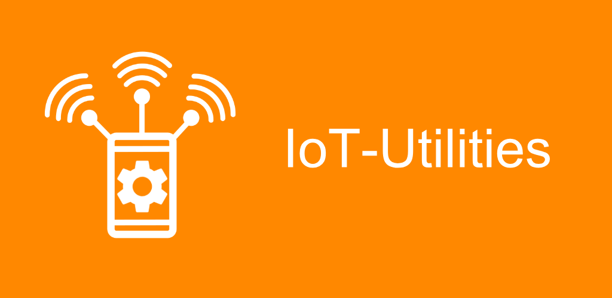

<!-- Not working in mobile app-->

# IoT-Utilities (Android App)

[End User License Agreement](./IoT-Utilities_EULA.md)

[Terms and Conditions](./IoT-Utilities_Terms_and_Conditions.md)

[Privacy Statement](./IoT-Utilities-Privacy-Statement_EN.md)

## What is the purpose of this app?

[Aruba, a Hewlett Packard Enterprise (HPE) company](https://www.arubanetworks.com/) supports IoT applications based on Wi-Fi (e.g. Wi-Fi tracking), BLE (e.g. asset tracking and sensor monitoring), ZigBee and 3rd party protocols via USB-extension by providing the connection layer using Aruba access points as gateways.

More information about this functionality and its specification can be found here:

Aruba Support Portal  
[https://asp.arubanetworks.com/downloads;search=iot](https://asp.arubanetworks.com/downloads;search=iot)  

ArubaOS WLAN and Aruba Instant 8.6.0.x IoT Interface Guide  
[https://support.hpe.com/hpesc/public/docDisplay?docId=a00100259en\_us](https://support.hpe.com/hpesc/public/docDisplay?docId=a00100259en_us)  

The IoT-Utilities app is a generic tool to get to know and demonstrate the "Aruba IoT Interface" functionality provided by an Aruba access point infrastructure to integrate with IoT applications. The app provides a basic server functionality Aruba access points and controllers can connect to using the Aruba IoT interface. Data received via the Aruba IoT Interface, e.g. BLE telemetry, is decoded and shown in the app.

## This app provides the following tools and functionalities

### IoT Server

The app's IoT Server function accepts connections from Aruba controllers and Aruba Instant access points via the Aruba IoT interface using the secure WebSocket protocol and Google Protocol Buffer 2.0 for data encoding (telemetry-websocket). The IoT Server only allows encrypted connections (TLS/SSL). The required SSL server certificate can be imported into the app or a self-signed certificate can be generated.

### IoT Data

Different messages (topics) are used to send and receive data via the Aruba IoT Interface. The app decodes and views received data for supported messages types, e.g. BLE Telemetry, BLE Data, ... more to come.

### Web Dashboard

The app provides a web dashboard to show basic status information and to provide access to configuration templates from a web browser. Access to the dashboard is secured using HTTPS and username/password.

### AOS/Instant configuration templates for ease of setup

CLI configuration templates are provided within the app and via the web dashboard to setup an Aruba controller or Aruba Instant infrastructure to communicate with the app.

### BLE Test Tool

The BLE test tool allows to check the Aruba infrastructure setup/configuration by verifying if BLE test messages send via the smartphone's BLE radio are received back by the app via the Aruba IoT interface.

### Bluetooth Scanning

The app allows scanning for Bluetooth Low Energy (BLE) devices in range of the smartphone. Detailed information about the recorded BLE devices is shown in the app.

### Bluetooth Advertising

The app allows the configuration and sending of supported BLE advertisements, e.g. iBeacon or Eddystone, via the smartphone's BLE radio. 

## App requirements

- Smartphone with Wi-Fi & BLE radio
- Android 8.0 or higher
- Aruba 3xx or 5xx series access points with integrated BLE or BLE/ZigBee radio
- AOS/Aruba Instant version 8.7.0.0 or higher

---

**This app has been started as part of a student internship and is developed, published and supported as a leisure activity in collaboration with an Aruba employee. This app is not an official product of Aruba, a Hewlett Packard Enterprise (HPE) company.**

---

## Links

[Documentation](./docs/index.md)

[In-App Documentation](iot-utilities://docs/index.md)

Google Play and Google Play logo are trademarks of Google LLC
