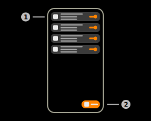

# BLE Advertising

The BLE-Advertising feature of the app allows the user to simulate BLE-Beacons using various protocols. The application currently only supports Apple iBeacon. Additional protocols such as EddyStone will be implemented in a later update of the app.
If [enabled](../settings/settings_bluetooth.md) this feature is able to run in the background indefinitely.

## 1) Advertiser list

This list contains all custom advertisers the user created. This list also contains the testing beacon of the [BLE-Testing](./ble_testing.md) feature of the app.

### a) Protocol icon

This view displays the current icon of the current protocol of the advertiser.

### b) Information summary

This view contains some information on the advertiser. The upper body contains the name of the custom advertiser. The text below the name contains some protocol specific information of the advertiser.

### c) State switch

This switch is used to enable and disable the custom advertiser. Move the switch to the right to start advertising with this custom advertiser. The state switch will be disabled if the maximum capacity limit is reached or the bluetooth radio of the device is offline/unavailable.

## 2) Create button

Tap this button to create a new simulated beacon. The app will prompt the user to select a specific protocol. As already mentioned, the app currently only supports Apple iBeacon.

## Additional features

### System capacity analysis

The application is capable of analysing the maximum BLE-Advertising capacity of your device. To do so, the app will start as many custom advertisers as possible, until the system reports an error. This analysis returns the maximum capacity of your device and will automatically apply this value to the Advertising UI. This analysis is executed every time the application starts.

## Menu items

### Keep screen on

If this checkbox is enabled, the screen of the device will not turn off automatically.

### Documentation

Tap this item to open the documentation of this page.

### Guide

Tap this item to start the interactive guide of this page.

### Find advertiser

Tap this item to search a specific custom beacon.