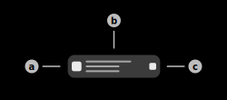
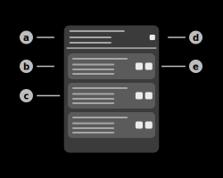

# BLE-Connect

This feature uses the Aruba IoT-Interface BLE-Connect functionality to connect to surrounding bluetooth devices via GATT. All GATT-Actions are redirected to the sensor which executes them on the local device.

## BLE-Connect Presets

The app uses "Presets" in order to save connection information of a specific device. This includes device MAC-Address, Access Points MAC-Address as well as the device name (optional). These presets can also save the "Bonding-Keys" when a device is bonded with an Access Point. They also offer the possibilty to automatically choose an Access Point depending on the received signal strength. The user can clone existing device information or manually create them. Alternatively, a connection can also be established by pressing and holding a device in the [BLE-Telemetry](./ble_telemetry.md) page of the app.

### 1) Create-Preset button

The application offers multiple possibilites to create BLE-Connect presets. Available options:

|Option|Description|
|-|-|
|Create manually|The user has to manually specify the parameters of the BLE-Connect preset, including: Preset name, Device MAC-Address, Sensor MAC-Address.|
|Recent connections|Shows a dialog to select the connection parameters of a recent connection. A connection can be established by tapping and holding the item in the [BLE Telemetry page](./ble_telemetry.md).|
|Import from BLE-Telemetry|Shows a dialog to import device information from the collected [BLE-Telemetry](./ble_telemetry.md) data of the IoT-Server feature. Selecting a device from the list will import the name, as well as the MAC-Address of the device. The sensor will be automatically selected when connecting.|
|Import from BLE-Data|Shows a dialog to import device information from the collected [BLE-Data](./ble_data.md) of the IoT-Server feature. Selecting a device frmo the list will import the name, as well as the MAC-Address of the device. The sensor will be automatically selected when connecting.|

The dialog displayed above is used to edit and create BLE-Connect presets.

#### a) Preset name field

This text field contains the name of the BLE-Connect preset. This field contains the name of the device when importing devices (default).

#### b) Auto-Select sensors switch

When this switch is enabled, the application will automatically select the sensor with the best signal strength (RSSI-Value) when connecting to the device. This algorithm uses all data sources of the server. If this switch is enabled, the sensor MAC-Address can be left blank.

#### c) Save / Create button

Tap this button to create or save the preset respectively. This button is only tappable if the input data is valid.

#### d) Device MAC-Address field

This text field contains the MAC-Address of the BLE-Device that should be connected to. This field only accepts valid MAC-Addresses.

#### e) Sensor MAC-Address field

This text field contains the MAC-Address of the sensor that should be used during the connection. This field only accepts valid MAC-Addresses or can be disabled using the [switch](#b-auto-select-sensors-switch) above.

### 2) BLE-Connect preset item

This item represents a BLE-Connect preset as described above. Tap the item to attempt establishing a connection or swipe it off the screen to permanently delete it.

#### a) Status indicator

This icon shows the current status of the BLE-Connect presets.

***1) Default state**

The BLE-Connect preset is currently in idle state. This means that no connection with this configuration currently exists. Furthermore, a connection can be attempted to establish by tapping the preset. This state is indicated by a gray icon.

***2) Connected state**

The BLE-Connect preset is currently in idle state. This means that a session using this configuration is currently open. Tab the preset item to show the session. This state is indicated by a green icon.

***3) Bonded state**

The BLE-Connect preset is currenlty in the bonded state. This means that the bonding information, required to establish a secure connection to the device, is stored in the local encrypted database of the application. A connection can be attempted to establish by tapping the preset. This state is indicated by a blue icon.

#### b) Main information section

This section contains the main information of the preset item. The upper text of this section contains the custom name of the preset. This name was specified by either the user or the app during creation. The center text of this section displays the MAC-Address or, if available, the name of the BLE-Device. The lower text of the section contains the MAC-Address or, if available, the name of the Aruba sensor. Tap the preset to attempt establishing a connection. This feature requires the IoT-Server feature to be running.

#### c) Edit button

Tap this button to edit the parameters of the BLE-Connect preset. Tapping this button will show the [same dialog]() that is also displayed when creating BLE-Connect presets. Tap save to override the current BLE-Connect preset.

## BLE-Connect Bonds

### 1) BLE-Connect bond item

This item represents the bonding information of a specific device-sensor combination, required to establish an encrypted BLE connection. The item displays the MAC-Address of the device (upper text) as well as the MAC-Address of the sensor (lower text) used to authenticate recently. Swipe the item of the screen to delete the stored information. The bond information is stored in an encrypted database inside the application. The raw data that is saved during this process is not accessible at any time.

## BLE-Connect Sessions

The app uses "BLE-Connect sessions" when connecting to any BLE-Device using the IoT-Interface. The application is able to keep multiple session running in the background concurrently. However, the Aruba sensors only allow one session/connection per sensor/access point.

### Menu actions

#### **Show log**

Tap this item to show the log of the current session. This log contains all events that happened throughout the session (Error, Warning, Info, Debug).

#### **Pair/bond device**

Tap this item to pair or bond the current BLE-Device. This action is only available if the remote device has connected to the remote sensor. The app will prompt the user if a supported third-party device has been detected.

#### **Enable/disable keep alive**

Tap this item to enable/disable the [keep-alive ping](#session-keep-alive-ping) of the current session.

#### **Remove bond information**

Tap this item to remove the bonding key material from the encrypted database of the application. This only is available for bonded BLE-Devices.

#### **Show/Hide interaction**

Tap this item to show/hide the interaction layout of third-party devices. This item is only available if the third-party device is connected and bonded to the sensor.

#### **Pending actions**

Tap this item to display all currently pending BLE-Connect actions. This dialog will additionally display details on the specific actions, such as type and the time when the action has been sent to the remote device.

### Offline page

Page that is displayed if the connection is currently offline. This page can additionally display the cause of the disconnection if available.

### Failed page

Page that is displayed if the connection failed due to an exception. A short summary of the exception is displayed by the page. However, the detailed stack trace can be viewed via the log. The log of the session is accessible via the tab header options or the failed page.

### Pending page

Page that is displayed if the connection is established but the application is waiting for the device to complete an action.

### Connected page

Page that is displayed if the connection is established. The interaction pages will be provided as soon as the services become available.

#### **1) Service filter field**

Field that contains the current GATT-Service filter. This filter can search either a specific service name or a specific service UUID.

#### **2) Clear/Hide button**

**Hide button:**

This button hides most parts of the filter layout. Only the [service filter field](#1-service-filter-field) remains visible.

**Clear button:**

This button hides most parts of the filter layout (similar to hide) and furthermore, clears all filters.

#### **3) Characteristics filter field**

Field that contains the current GATT-Characteristics filter. This filter can search either a specific characteristics name or a specific characteristics UUID.

#### **4) GATT-Service item**

This item represents a BLE GATT-Service as described in the [official documentation](https://www.bluetooth.com/de/bluetooth-resources/intro-to-bluetooth-gap-gatt/).

#### **a) Service information**

This section contains the main information of the GATT-Service. The upper body of this section displays the name of the GATT-Service. This name is resolved from the [Offical Bluetooth Specification](https://www.bluetooth.com/de/specifications/assigned-numbers/). The center text of the item contains the UUID of the GATT-Service. This value is retrieved via the Aruba IoT-Interface. The lower text of this section shows the amount of GATT-Characteristics of the service.

#### **b) Characteristics item**

This sub-item represents a BLE GATT-Characteristic as described in the [official documentation](https://www.bluetooth.com/de/bluetooth-resources/intro-to-bluetooth-gap-gatt/).

#### **c) Characteristics information**

This section of the sub-item contains the main information of the GATT-Characteristic. Detailed information can be viewed by tapping the characteristics item. The upper text of this section displays the display name of the characteristic. This name is resolved from the [Official Bluetooth Specification](https://www.bluetooth.com/de/bluetooth-resources/intro-to-bluetooth-gap-gatt/).

#### **d) Expansion switch**

This switch is used to expand and collapse all GATT-Characteristics of this service.

#### **e) GATT action buttons**

These buttons can be used to manually send GATT-Commands via the Aruba IoT-Interface to the remote BLE-Device. Available actions:

|Action|Description|Requirements|
|-|-|-|
|GATT-Write|Write a specific raw byte value to the selected characteristic of the service.|writeWithResponse, writeWithoutResponse|
|GATT-Read|Read the current raw byte value from the selected characteristic of the service.|read|
|GATT-Notify (Coming soon)|Notify the application via the IoT-Interface when the value of the selected characteristic of the service changes.|notify|
|GATT-Indicate (Coming soon)|Notify the application via the IoT-Interface when the value of the selected characteristic of the service changes. In comparison to notify is an acknowledgement required.|indicate|

## Pairing & Bonding

The app offers multiple possibilities to pair & bond with various BLE-Device and consequently establish a secure encrypted connection. This authentication process can be manually started by the user or automatically handled by the application when connecting to known third-party device. The app currently only supports Philips Hue lamps as third-party devices.

The difference between pairing and bonding as described in the official documentation is, that bonding allows storing long-term keys for reauthentication if the two devices closed the connection. These keys can be stored securely by the application to reauthenticate with the device at any time.

### Automated authentication mode

The application is capable of automatically pairing & bonding specific third-party devices. The app will prompt the user if a supported third party device is detected. After the user confirmed, the application will automatically bond the third-party device. Alternatively, the manual authentication mode can also be used with these devices by using the dropdown menu of the session tab.

Supported third-party devices:
- Philips Hue devices (Hue Go, Hue Lamp, Hue Bulb)

### Manual authentication mode

This mode is used to manually authenticate with the remote BLE-Device. However, the user needs to know the authentication specification of the BLE-Device in order to authenticate.

> **_Note:_** The key material of the individual keys (e.g. Own, OOB, ...) is automatically provided by the application if the corresponding field is left empty.

#### **1) Method dropdown**

This dropdown menu is used to select the authentication method that will be used throughout the process. Available methods:

|Method|Explanation|Requirements|
|-|-|-|
|None (Legacy)|No additional authentication procedure required. Weakest link encryption on BLE-Level.|No requirements|
|Passkey (Legacy)|Authentication procedure uses a 6-digit passkey.|6-digit valid passkey|
|OOB (Legacy)|Out-of-Band authentication is used during the process. This means that the key data is provided by a third party technology (e.g. NFC)|OOB-Key (Hex) and optional Passkey required|
|None (LESC)|Low Energy Secure Connection without any additional authentication procedure.|Own-Key (Hex) required|
|Passkey (LESC)|Low Energy Secure Connection with additional 6-digit passkey|Own-Key (Hex) as well as valid 6-digit Passkey required|
|OOB (LESC)|Low Energy Secure Connection with additional OOB-Key that is provided by a third party technology (e.g. NFC)|Own-Key (Hex) as well as OOB-Key (Hex) and optional Passkey required|

*LESC = Low Energy Secure Connection  
*OOB = Out of Band

#### **2) Bonding checkbox**

Tick this checkbox to enable device bonding. The exchanged bonding key of the devices will be saved encrypted automatically. The app will reauthenticate with the device automatically upon reconnection.

#### **3) LESC checkbox**

Tick this checkbox to enable LESC (Low Energy Secure Connection) connections. These connection are usually more secure and need an additional [Own-Key](#5-lesc-own-key-field) provided in order to authenticate.

#### **4) Passkey field**

This field contains the 6-digit Passkey that is used during Passkey (Legacy) and Passkey (LESC) pairing/bonding.  
The application will automatically generate a Passkey if the field is left empty.

#### **5) LESC Own-Key field**

This field contains the hex key that is used during LESC pairing/bonding.  
The application will automatically generate a key if the field is left empty.

#### **6) OOB-Key field**

This field contains the hex key that is used during OOB (Legacy) and OOB (LESC) pairing/bonding.  
The application will automatically generate a key if the field is left empty.

#### **7) Authenticate (& bond) button**

Press this button to send the authentication request to the remote BLE-Device via the Aruba IoT Interface. The Aruba sensor will send the response of this request back to the server.

## Additional features

### Session keep-alive ping

The application will send a gattRead-command for a random service and characteristic to the remote device to prevent the current session from timing out. This feature can be disabled entirely in the [settings](../settings/settings_iotserver.md).

## Menu items

### Keep screen on

If this checkbox is enabled, the screen of the device will not turn off automatically.

### Documentation

Tap this item to open the documentation of this page.

### Guide

Tap this item to start the interactive guide of this page.