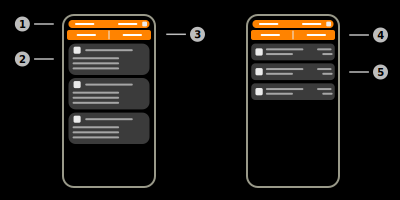
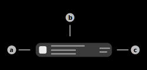

# BLE Data Details

This page contains detailed information on the received Northbound BLE data. This is a generic page that is used for all Northbound data details. This page contains multiple tabs for various data types.

## 1) Sensor selector

This layout is used to select the parent sensor of the viewed data. Tap the sensor name to select an alternative sensor. The page will automatically load the new data if the sensor has changed.

## 2) Detailed information

This layout displays the detailed information of the BLE-Device. Available information:

|Title|Explanation|Entries|
|-|-|-|
|General|General information of the data|Device Mac, Device RSSI, View raw (button)|
|iBeacon|Specific data of the iBeacon protocol of the device|UUID, Major, Minor, TxPower|

## 3) BLE-Data tab

This tab contains detailed information on the BLE-Data that has been received for the specific device.

## 4) Sensors tab

This tab contains all sensors that reported the selected device with their respective RSSI values.

## 5) Sensor item

This item represents a sensor (Aruba Access Point) that reported the selected BLE-Device. Tap this item to show the RSSI (transmission strength) value graph of the sensor.

### a) Sensor icon

This icon indicates that the displayed item should reference a sensor.

### b) Sensor name

This text displays the local name of the sensor.

### c) Transmission strength (RSSI)

This text displays the last transmission strength (RSSI) value that has been received.

## Menu items

### Documentation

Tap this item to open the documentation of this page.

### Guide

Tap this item to start the interactive guide of this page.

### Freeze / unfreeze data view

Tap this item to freeze the current data view. This means that updates of the data will be discarded and not displayed on the current page. Tap this item again to unfreeze the current page.