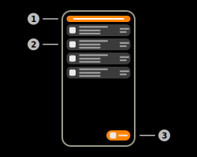
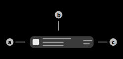

# BLE Scanning

## 1) Filter interface

When this button is pressed, the filter configuration layout will appear. This layout will allow the user to configure different BLE filteres. The filter interface can hold multiple filters of the same and different types.  
Different filter types are compared using AND, e.g. if the filters "Name" and "Mac" are applied, the devices have to fulfill both criteria.  
Identical filter types are compared using OR, e.g. if two filters of the type "Name" are applied, the devices have to fulfill only one of the provided filters.  
Additionally the filter layout of this page also provides two sliders to select minimum/maximum signal strength (RSSI) values.

|Filter|Usage|Example|
|-|-|-|
|Name|Local name of the BLE-Device|Hue Lamp|
|Mac|Local MAC-Address of the BLE-Device|AA:BB:CC:DD:EE:FF|
|Protocol|Protocol of the BLE-Device|iBeacon, EddyStone, ExposureNotification|

## 2) BLE-Device item

This item represents a BLE-Device in range of the device.  
Tap this item to show the detailed information on this device. Tap and hold this item to copy the advertiser information into the local database. This information is available as a custom advertiser in the [BLE-Advertising](./ble_advertising.md) page.

### a) Protocol icon

Displays the icon of the current protocol of the BLE-Device. Supported protocols: iBeacon, EddyStone (unspecific), ExposureNotification

### b) Information summary

This view contains the main information of the BLE-Device. The upper text of this view displays the MAC-Address of the BLE-Device. The center text of this view displays the protocols of the BLE-Device, if available. The lower text of this view contains the device manufacturer of the device if available. This name is fetched from the [Offical Bluetooth Specification](https://www.bluetooth.com/specifications/assigned-numbers/company-identifiers/).

### c) Transmission strength

Displays the last transmission strength (RSSI) value in dBm.

## 3) Scan button

Tap this button to start or stop the scanning process. This button will be disabled, if the BLE radio of the device is offline/unavailable.

## Additional features

### Scanning mode

The app provides the possibility to select a specific BLE-Scanning mode. This mode is sent to the system and determines how the data is collected. This mode can be selected in the app's [preferences](../settings/settings_bluetooth.md). Available modes:

|Mode|Explanation|
|-|-|
|Low Latency|Collects as much data as possible. Consumes the highest amount of energy.|
|Balanced|Mode in between Low Latency and Low Power. Balanced amount of data and energy consumption.|
|Low Power|Collects the least amount of data. Consumes the least amount of battery.|

## Menu items

### Keep screen on

If this checkbox is enabled, the screen of the device will not turn off automatically.

### Documentation

Tap this item to open the documentation of this page.

### Guide

Tap this item to start the interactive guide of this page.

### Clear all

Tap this item to clear the local BLE-Scanning database.