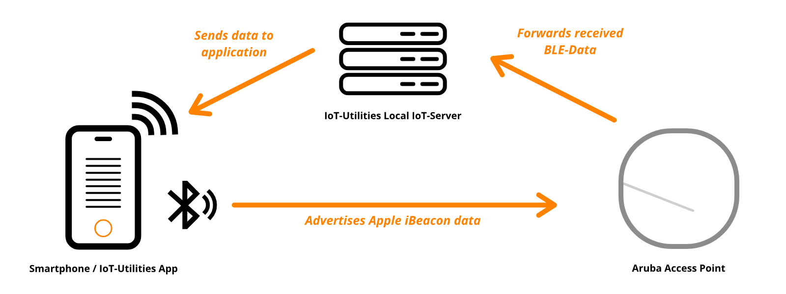

# BLE Testing

This document explains the concept of the feature BLE-Testing which uses the [Aruba IoT Interface](../aruba/aruba_iot_configuration_guide.md) to validate the user's configuration.

## Basic princinples

The BLE-Testing feature sends a BLE advertising packet via the bluetooth radio of the mobile device. The Aruba Access Point should receive this data and forwards it to the IoT-Server. The server validates and evaluates the incoming data. If the message contains all properties of the [Testing beacon](#testing-beacon) the Access Point / sensor will be treated as "in-range". The user can also specify multiple [parameters](#testing-parameters) to control the test and customize the testing conditions.

> **_Note:_** The server only accepts BLE-Data messages during tests to optimize performance and latency during the test.

## Testing parameters

### Testing duration

This value specifies the duration of the test. The timer starts once the ["Running"-phase](#running-stage) started. Additionally, the test will stop automatically once this time expired. The user can select a duration between 10s and 90s. This value can also be set to infinity. Consequently, the test will run in the background indefinitely.

### Sensor visibility threshold

This value specifies when an Access Point / sensor will be treated as out of range. Thus, the sensor will disappear from the list. The user can select a value between 0s (no timeout) and 60s.

### RSSI threshold

This value specifies the weakest required signal strength of the forwarded signals. Therefore, all messages that don't match the requirement will be ignored. The UI will indicate these messages by a red color. Valid messages will be indicated by the accent color of the app (orange in light-mode and blue in dark-mode). The user can specify a value between -100 and 0 dBm.

## Testing beacon

The testing beacon uses Apple's iBeacon protocol and will be used during the entire test. It will be generated during the setup process but the user can also create a new or pick an existing advertiser from the internal database.

|Value|Description|Example|
|-|-|-|
|UUID|Type 4 Univerisal Unique Identifier (pseudo-randomly-generated) refering to [RFC 4122](https://www.ietf.org/rfc/rfc4122.txt)|636645d0-2020-2020-2021-dfbaa5d78db8|
|Major|Integer value between 0 and 65536|119|
|Minor|Integer value between 0 and 65536|1278|

> **_Note:_** All values will be generated during setup and can be modifed at any time.

## Testing stages

### Idle-Stage

The idle-stage is the start stage of the test. It will also enter this stage again when the test finishes. The parameters are only changeable in this stage of the test.

### Pending-Stage

The test will enter the pending-stage if there aren't any clients available at the time of the start. Moreover, it will remain in this stage as long as no client transmitts any data. The [duration timer](#testing-duration) won't run in this stage as this stage can run indefinetely (until is is stopped or any client connects).

### Running-Stage

This is the main stage of the test. The device will start advertising the testing beacon with the specified parameters. Additionally, the app tries to free as many resources as possible, to reduce the latency. The test will start searching for the testing beacon in every arriving message. Finally, this stage will be completed when the [timer](#testing-duration) expires (if set) or the user cancels the test.

### Complete-Stage

The test will enter this stage when the [running stage](#running-stage) finished. The test service is now offline but the results are still viewable.

### Failed-Stage

The test will enter this stage when any exception occured. The test service is now offline but the results as well as the received data are visible.

## BLE-Testing page

### 1) Start button

Tap this button to start the test. This feature requires the IoT-Server feature to be running.

### 2) Test duration

This slider will set the duration of the test in seconds. Drag the slider to the right to let the test run indefinetely.

### 3) Sensor timeout

This slider will set the sensor timeout of the test in seconds. This is the interval after which the sensor will be treated as out of range.

### 4) RSSI threshold

This slider will set the RSSI threshold value of the test in dBm. This is the minimum required signal strength of the incoming packages to be treated as in range.

### 5) Testing beacon

This card displays the general information of the testing beacon.

- Tap the card to select a new testing beacon
- Hold the card to edit the current testing beacon
- Tap the info-icon of this card to show detailed information on the testing beacon

### 6) Live status layout

This layout displays the live status of the test. The phone icon on the left side represents the app. This view shows a specific animation if the phone is currently advertising the IBeacon data. The access point icon on the right side represents any Aruba Access Point. The tube in the center of these two icons represents the socket connection that is established between the app and the access point. This view will show an animation, every time a valid message is received.
- Blue/Orange color for valid messages
- Red color for invalid messages (e.g. strength (RSSI) is to weak)

### 7) Sensor list

This list contains all sensors that send the response signal to the app. Every item contains specific information on the sensor.

#### **a) Main sensor icon**

Icon that indicates that the item represents a sensor.

#### **b) Sensor name**

This view displays the local name of the sensor if it is available.

#### **c) RSSI value and trend**

This view displays the last transmission strength value (RSSI) of the received packages, as well as the current trend of this value.

Green - The signal became stronger
Gray - The signal remained stable
Red - The signal became weaker

#### **d) Total messages**

This view displays the current count of messages that have been received by the sensor.

#### **e) Last seen**

This view displays the date when the last message has been received and the time delta, if the app already received multiple messages by this sensor.

### 8) Stop button and timer output

By default, this view will display the time elapsed since the start of the test in seconds. If the test duration is configured, it will show the remaining time of the test in seconds. Tap this view to cancel the current test. Tap it again to restart the test.

## Menu items

### Keep screen on

If this checkbox is enabled, the screen of the device will not turn off automatically.

### Documentation

Tap this item to open the documentation of this page.

### Guide

Tap this item to start the interactive guide of this page.