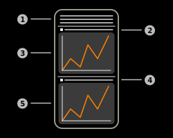

# Server Traffic

This page is used to display various statistics and the traffic analysis of the IoT-Endpoint server feature. This page can be opened using the [Dashboard](./dashboard.md).

## 1) General server statistics

This field contains general server statistics values.

### a) Total data received

This field contains the total data the server received during it's [uptime](#3-total-server-uptime) in bytes. This only contains Protocol Buffer packages that have been decoded during data processing. Consequently, this statistic does not keep hold of any miscellaneous data e.g. WebSocket-Frame data, Authentication JSON data.

### b) Average server read

This field contains the average read rate of the server in B/s or Bit/s (can be modified in [settings](../settings/settings_general.md). This value is calculated during the total [uptime](#3-total-server-uptime) and differs from the server [live write rate](#4-server-write-rate).

### c) Total server uptime

This field contains the total uptime of the server. This refers to the timespan between the last time the server has been started and the last time the server has been stopped. This value is used to calculate e.g. the [average read](#2-average-server-read) value.

## 2) Server write rate

This field contains the live server read value in B/s or Bit/s (can be modified in [settings](../settings/settings_general.md). This contains every data that is sent through the server pipeline. Furthermore, this value is more accurate than the [average read](#2-average-server-read) value. It only keeps track of the last 100 seconds of the server's uptime.

## 3) Server write rate graph

This graph shows the values of the last 100 seconds of the [server write rate](#2-server-write-rate).

## 4) Server read rate

This field contains the live server write value in B/s or Bit/s (can be modified in [settings](../settings/settings_general.md). This contains every data that is read by the server pipeline. It only keeps track of the last 100 seconds of the server's uptime.

## 5) Server read rate graph

This graph shows the values of the last 100 seconds of the [server read rate](#4-server-read-rate).