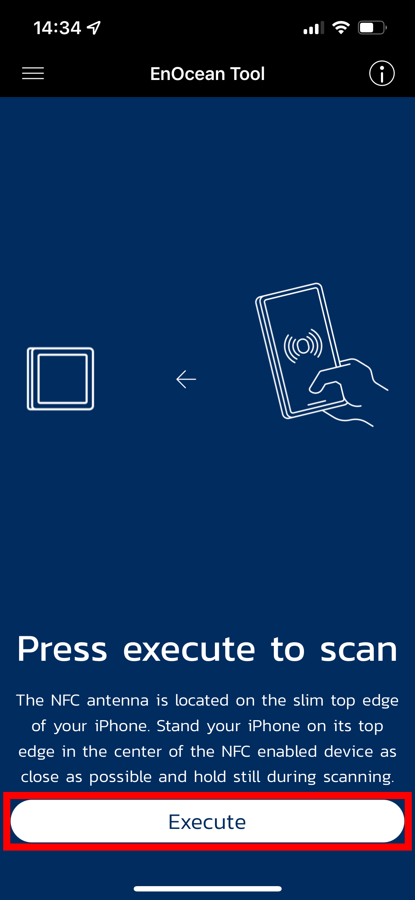
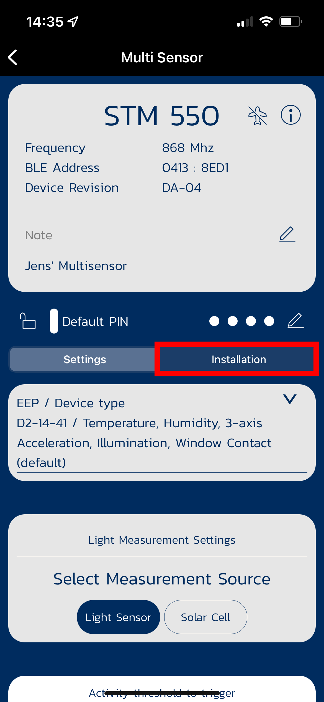

# EnOcean Teach-In Tutorial

The "teach-in-procedure" is used to exchange the profile identifier and sender identifier between to EnOcean serial devices. The method used to trigger a transmission of these telegrams differs depending on the device.

Some EnOcean devices support configuration via NFC. The "EnOcean Tool"-app can be used to trigger the learn telegram of the device.

## Step 1: Connect the device via NFC

## Step 2: Switch to the tab "Installation"

## Step 3: Trigger the transmission of the learn telegram

