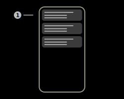
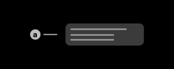

# IoT-Connector

This page contains the IoT-Connector data/entries that have been received in IoT-Connector Northbound packages by the server.

> **_Note:_** The Aruba infrastructure of this feature is still in development. Therefore the app-side implementation of this feature is not final.

## 1) IoT-Connector item

This item represents an IoT-Connector data entry of the local database. The app currently does not put the reported devices of the data entry into a seperate database.  
Tap this item to view the data of the entry.

## Menu items

### Keep screen on

If this checkbox is enabled, the screen of the device will not turn off automatically.

### Documentation

Tap this item to open the documentation of this page.