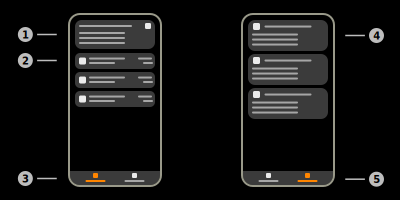

# IoT-Connector Details

This page is used to view IoT-Connector data details.

> **_Note:_** The Aruba infrastructure of this feature is still in development. Therefore the app-side implementation of this feature is not final.

## 1) Data information summary

This expandable card contains additional information on the viewed data. Available information:

|Name|Information|
|-|-|
|Origin|IP-Address of the client that reported the devices|
|Data topic|Topic of the data that was received (either TOPIC_TELEMETRY or TOPIC_BLE_DATA|
|Header version|Version of the protobuf header in the message|
|Total device count|Total count of devices contained in the data package|

## 2) IoT-Connector device item

This item represents a BLE-Device that is included in the IoT-Connector report.
Tap this item to show the detailed information on this device.

### a) Protocol icon

Displays the icon of the current protocol of the BLE-Device. The IoT-Connector implementation currently does not support common protocols, like iBeacon or EddyStone.

### b) Information summary

This view contains the main information of the BLE-Device. The upper text of this view displays the MAC-Address of the BLE-Device. The lower text of this view displays the protocols of the BLE-Device, if available.

### c) Transmission strength

Displays the last transmission strength (RSSI) value in dBm.

## 3) Devices tab

This tab contains a list of all devices included in the report.

## 4) Detailed information

## 5) Details tab

This tab contains detailed information on a specific device.