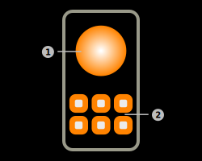

# Philips Hue Interaction

The app provides a feature to control Philips Hue lamps. This feature uses BLE-Connect and the BLE GATT protocol to communicate with the lamp. The Philips Hue lamp needs to be bonded to the remote sensor in order to accept incoming commands.

> **_Note:_** Feature requires ArubaOS/InstantOS 8.8 or higher for BLE authentication and encryption.

## Interaction layout

### 1) State switch

Tap this button to turn the Philips Hue Lamp on and off. This switch will automatically apply to the current state of the lamp.

### 2) Brightness slider

Use this slider to manually set the brightness of the Philips Hue lamp. This slider will automatically apply to the current state of the lamp.

### 3) Color picker button

Tap this button to select the new color of the Philips Hue lamp. This button will show a rgb color picker in order to select the new color. The app is currently not capable of retrieving the current color of the lamp.

### 4) Color temperature picker

Tap this button to select the new color temperature of the Philips Hue lamp. The app currently only supports selecting color temperature presets and is currently not capable of retrieving the current color temperature of the lamp.

### 5) Animation button

Tap this button to play an animation on the Philips Hue lamp. Available animations:

|Animation|Details|
|-|-|
|White Flash Animation|The Hue lamp will start flashing in a white color every 500 ms.|
|Rainbow Animation|The Hue lamp will start switching the colors like a rainbow.|

### 6) Factory default reset button

Tap this button to reset the Philips Hue Lamp to factory default settings. This will also remove the bonding from the application.