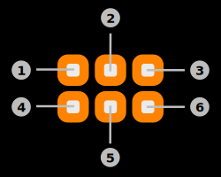

# Philips Hue Interaction

The app provides a feature to control Philips Hue lamps. This feature uses BLE-Connect and the BLE GATT protocol to communicate with the lamp. The Philips Hue lamp needs to be bonded to the remote sensor in order to accept incoming commands.

The app provides a feature to control Philips Hue lamps. This feature uses BLE-Connect and the BLE-GATT protocol or the ZigBee network and the ZigBee Cluster Library protocol to communicate with the lamp.

> **_Note:_** Feature requires ArubaOS/InstantOS 8.8 or higher for BLE authentication and encryption.

## Interaction

### 1) Color selection wheel

Tap anywhere on the color wheel in order to change the current color of the lamp. The interaction page will always be tinted in the current color of the lamp.

### 2) Action buttons

|Button|Bluetooth|ZigBee|
|-|-|-|
|1|**Change name:** Tap this button to change the BLE local name of the Philips Hue lamp.|**Periodic update configuration:** Tap this button to configure the periodic updating of the values. As the ZigBee implementation of the application currently does not support subscribing to data changes, the current values of the lamp are fetched automatically. This button invokes a dialog to change the interval or disable the feature entirely.|
|2|**State:** Tap this button to turn the lamp on and off respectively.|**State:** Tap this button to turn the lamp on and off respectively.|
|3|**Factory reset:** Tap this button to reset the lamp to factory default settings. This will cause the connection to be aborted. Additionally, the app is not able to reconnect to the lamp without updating to the new BLE address and authenticating again.|**Identify lamp:** Tap this button to send a ZCL: Identify command to the Philips Hue lamp. This command will cause the lamp to blink in a white color multiple times.|
|4|**Brightness:** Pressing this button will cause it to expand to a slider displaying the current brightness of the lamp (in percent). Tap anywhere on the slider in order to set the new brightness of the lamp.|**Brightness:** Pressing this button will cause it to expand to a slider displaying the current brightness of the lamp (in percent). Tap anyhwere on the slider in order to set the new brightness of the lamp.|
|5|**Temperature:** Pressing this button will cause it to expand to a slider displaying the current color temperature (in Kelvin). Tap anywhere on the slider in order to set the new color temperature of the lamp.|**Temperature:** Pressing this button will cause it to expand to a slider displaying the current color temperature (in Kelvin). Tap anywhere on the slider in order to set the new color temperature of the lamp.|
|6|**Animation:** Tap this button to select an animation that is played on the lamp. Tap this button again to stop all running animations.|**Animation:** Tap this button to select an animation that is played on the lamp. Tap this button again to stop all running animations.|

> **_Note: Not all features are available for the BLE and ZigBee implementations of the application._**

|Feature|BLE|ZigBee|
|-|-|-|
|State|X|X|
|Color|X|X|
|Brightness|X|X|
|Color Temperature|X|X|
|Update Name|X|O|
|Factory Reset|X|O|
|Identify|O|X|
|Automatic Updates|X|O|
|Animations|X|X|

**X** - Feature available  
**O** - Feature unavailable