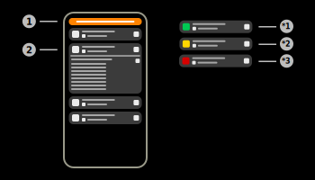
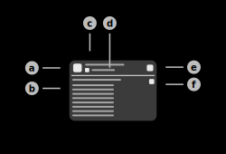

# Sensors

The sensors page of the app is used to display and manage all Aruba sensors.

## 1) Filter interface

When this button is pressed, the filter configuration layout will appear. This layout will allow the user to configure different sensor filters. The filter interface can hold multiple filters of the same and different types.  
Different filter types are compared using AND, e.g. if the filters "Username" and "Client IP" are applied, the clients have to fulfill both criteria.  
Identical filter types are compared using OR, e.g. if two filters of the type "Username" are applied, the clients have to fulfill only one of the provided filters. 

|Filter|Usage|Example|
|-|-|-|
|Name|Local name of the Aruba sensor|ap505h|
|Mac|Local MAC-Address of the Aruba sensor|AA:BB:CC:DD:EE:FF|
|IPv4|Local IPv4-Address of the Aruba sensor|192.168.100.XXX|
|IPv6|Local IPv6-Address of the Aruba sensor|0001:0db8:3c4d:0015:0000:0000:1a2f:1a2b|
|Client IP|Parent client IP-Address of the Aruba sensor|192.168.100.XXX|
|Hardware|Hardware information of the Aruba sensor|AP-505H|
|Software|Software information of the Aruba sensor|8.8.0.1-8.8.0.1 80393|

## 2) Sensor item

### a) Health status indicator

Displays the current status of the sensor instance received in Aruba health messages. The status won't be available until any health message is received by the server ([Available statuses](#available-health-statuses)).

### b) Detailed sensor information

Expandandable section of the item that displays detailed information on the sensor. Available information:

|Field|Explanation|Example|
|-|-|-|
|Reporter name|Local name of the sensor|ap515|
|Reporter mac|Local MAC-Address of the sensor|AA:BB:CC:DD:EE:FF|
|IPv4-Address|Local IPv4-Address of the sensor ([RFC 791](https://datatracker.ietf.org/doc/html/rfc791))|192.168.100.XX|
|IPv6-Address|Local IPv6-Address of the sensor ([RFC 8200](https://datatracker.ietf.org/doc/html/rfc8200)/[RFC 2460](https://datatracker.ietf.org/doc/html/rfc2460))|0001:0db8:3c4d:0015:0000:0000:1a2f:1a2b|
|Client-IP|Last IP-Address a report of this sensor was received from|192.168.100.XX (12345)|
|Hardware Info|Aruba hardware information of the sensor|AP-505|
|Software Info|Aruba software information and builder number of the sensor|8.8.0.1-8.8.0.1 Build 80393|
|Health status|Last received health status of the sensor|healthy|
|Last seen|Time when the last report of the sensor has been received|15:34:11|

This section can also contain detailed information on the health status of the sensor. The app is able to read the status of the internal and external radios, as well as connected USB devices.

#### **Internal radio information (referred to as IoT-Radio (internal))**

The health status message of each sensor can contain advanced information on the internal BLE-Radio of the sensor. Available information:

|Field|Explanation|Example|
|-|-|-|
|Radio mac|Local MAC-Address of the internal BLE-Radio|AA:BB:CC:DD:EE:FF|
|Hardware|Hardware generation of the internal BLE-Radio|gen2|
|Firmware|Firmware of the internal BLE-Radio|arubaDefault|
|Health status|Last received health status of the internal BLE-Radio|healthy|

#### **External radio information (referred to as IoT-Radio (external))**

The health status message of each sensor can contain advanced information on the external BLE-Radio of the sensor. Available information:

|Field|Explanation|Example|
|-|-|-|
|Radio mac|Local MAC-Address of the external BLE-Radio|AA:BB:CC:DD:EE:FF|
|Hardware|Hardware generation of the external BLE-Radio|gen1|
|Firmware|Firmware of the external BLE-Radio|arubaDefault|
|Health status|Last received health status of the external BLE-Radio|degraded|

#### **USB-Device health information (referred to as USB-Device))**

The health status message of each sensor can contain advanced information on an USB-Device that is connected to the sensor.

|Field|Explanation|Example|
|-|-|-|
|Identifier|Local identifier string of the USB-Device|USB antenna A|
|Health status|Last received health status of the connected USB-Device|unavailable|

#### **Available health statuses**

<b>Healthy:</b> Device is operating correctly (green).  
<b>Degraded:</b> Device might not be operating correctly because of some exception (yellow).  
<b>Unavailable:</b> The device currently is not available to the sensor (red).  

### c) Local identifier

This field displays the local name of the sensor if it is available. Otherwise, it will display the local IP-Address of the sensor.

### d) Sensor information summary

This field displays the time when the last update of the sensor has been received. Furthermore, this field will summarize the health status of all connected devices as explained in [b](#b-detailed-sensor-information). This field will show the respective icon of the device and the status indicated by a color (red, yellow, green).

### e) Expansion switch

This switch is used to expand and collapse the detailed information on the sensor.

### f) Copy information button

This button displays a dialog that allows the user to copy information of the sensor. Available information: Name, Mac, IPv4, IPv6, Parent IP, Hardware, Software, Health.

## Menu items

### Keep screen on

If this checkbox is enabled, the screen of the device will not turn off automatically.

### Documentation

Tap this item to open the documentation of this page.

### Guide

Tap this item to start the interactive guide of this page.

### Health status

Tap this item to display a legend, containing all available health statuses.