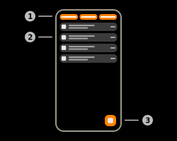
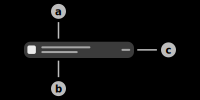
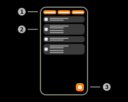
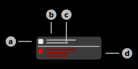
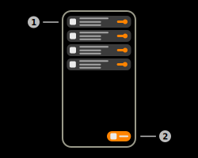
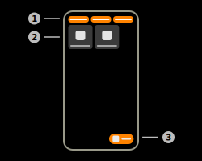

# Serial Data

This feature uses the Aruba IoT-Interface Serial Data functionality to exchange data with Serial devices in the local network of the Access Point.

## Serial USB Identifiers

### 1) Tab Selector

This selector is used to switch between the three tabs of the Serial Data page: USB-Identifiers, Messages, Devices.

### 2) USB-Identifier Item

This item represents a single USB-Identifier that was received via the Aruba-IoT Interface. A USB-Identifier is used to represent a device that is connected to the Aruba Access Point using USB.

> **_Note:_** For example, the USB-Identifier of EnOcean USB radios starts with the prefix "ENOCEAN_USB:". This identifier is also used to send Serial data using the SouthBound API implementation.

#### **a) USB-Identifier Title**

This view displays the USB-Identifier itself.

#### **b) USB-Identifier Subtitle**

This view displays the sensor that reported the USB-Identifier. This view will display either the name, iPv4-Address or MAC-Address of the sensor depending on the available data. This view is able to display multiple sensors, however each USB-Identifier should only be reported by a single sensor.

#### **c) Message Counter**

This view displays the amount of messages received with this USB-Identifier. This counter will flash in a green color every time a new message is received.

### 3) Filter Button

## Serial Data Messages

### 1) Tab Selector

This selector is used to switch between the three tabs of the Serial data page: USB-Identifiers, Messages, Devices.

### 2) Serial Data Message Item

This item represents a single Serial data message that was either received or sent using the Aruba IoT-Interface.

#### **a) Type Icon**

This icon represents the current type of the Serial data message.

|1|2|
|-|-|
||Hey|

#### **b) Message USB-Identifier**

#### **c) Details Information**

#### **d) Error Information**

### 3) Filter Button

## EnOcean Serial Devices

### 1) Tab Selector

This selector is used to switch between the three tabs of the Serial data page: USB-Identifiers, Messages, Devices.

### Supported EnOcean Equipment Profiles

|Profile Identifier|Profile Type|Profile Function|
|-|-|-|
|F6-01-01|Push Button|Switch Buttons|
|F6-02-01|Light and Blind Control - Application Style 1|Rocker Switch, 2 Rocker|
|F6-FF-01|Light and Blind Control - Custom Profile|BSC-ZS1S-230V Socket Switching Actuator|
|D2-14-40|Indoor - Temperature, Humidity, XYZ Acceleration, Illumination Sensor|Multi Function Sensors|
|D2-14-41|Indoor - Temperature, Humidity, XYZ Acceleration, Illumination Sensor, Window Contact|Multi Function Sensors|
|A5-02-01|Temperature Sensor Range -40°C to 0°C|Temperature Sensors|
|A5-02-02|Temperature Sensor Range -30°C to +10°C|Temperature Sensors|
|A5-02-03|Temperature Sensor Range -20°C to +20°C|Temperature Sensors|
|A5-02-04|Temperature Sensor Range -10°C to +30°C|Temperature Sensors|
|A5-02-05|Temperature Sensor Range 0°C to +40°C|Temperature Sensors|
|A5-02-06|Temperature Sensor Range +10°C to +50°C|Temperature Sensors|
|A5-02-07|Temperature Sensor Range +20°C to +60°C|Temperature Sensors|
|A5-02-08|Temperature Sensor Range +30°C to +70°C|Temperature Sensors|
|A5-02-09|Temperature Sensor Range +40°C to +80°C|Temperature Sensors|
|A5-02-0A|Temperature Sensor Range +50°C to +90°C|Temperature Sensors|
|A5-02-0B|Temperature Sensor Range +60°C to +100°C|Temperature Sensors|
|A5-02-10|Temperature Sensor Range -60°C to +20°C|Temperature Sensors|
|A5-02-11|Temperature Sensor Range -50°C to +30°C|Temperature Sensors|
|A5-02-12|Temperature Sensor Range -40°C to +40°C|Temperature Sensors|
|A5-02-13|Temperature Sensor Range -30°C to +50°C|Temperature Sensors|
|A5-02-14|Temperature Sensor Range -20°C to +60°C|Temperature Sensors|
|A5-02-15|Temperature Sensor Range -10°C to +70°C|Temperature Sensors|
|A5-02-16|Temperature Sensor Range 0°C to +80°C|Temperature Sensors|
|A5-02-17|Temperature Sensor Range +10°C to +90°C|Temperature Sensors|
|A5-02-18|Temperature Sensor Range +20°C to +100°C|Temperature Sensors|
|A5-02-19|Temperature Sensor Range +30°C to +110°C|Temperature Sensors|
|A5-02-1A|Temperature Sensor Range +40°C to +120°C|Temperature Sensors|
|A5-02-1B|Temperature Sensor Range +50°C to +130°C|Temperature Sensors|
|A5-04-01|Temperature from 0°C to +40°C and Relative Humidity|Temperature and Humidity Sensor|
|A5-04-02|Temperature from -20°C to +60°C and Relative Humidity|Temperature and Humidity Sensor|
|A5-04-03|Temperature from -20°C to +60°C (10-bit measurement) and Relative Humidity|Temperature and Humidity Sensor|
|A5-06-01|Range 300 lx to 60.000 lx|Light Sensor|
|A5-06-02|Range 0 lx to 1.020 lx|Light Sensor|
|A5-06-03|Range 0 lx to 1000 lx (10-bit measurement)|Light Sensor|
|A5-14-05|Vibration/Tilt, Supply Voltage Monitor|Multi Function Sensors|
|D5-00-01|Single Input Contact|Contacts and Switches|