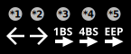
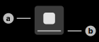

# Serial Data

This feature uses the Aruba IoT-Interface Serial Data functionality to exchange data with Serial devices in the local network of the Access Point.

## Serial USB Identifiers

### 1) Tab Selector

This selector is used to switch between the three tabs of the Serial Data page: USB-Identifiers, Messages, Devices.

### 2) USB-Identifier Item

This item represents a single USB-Identifier that was received via the Aruba-IoT Interface. A USB-Identifier is used to represent a device that is connected to the Aruba Access Point using USB.

> **_Note:_** For example, the USB-Identifier of EnOcean USB radios starts with the prefix "ENOCEAN_USB:". This identifier is also used to send Serial data using the Southbound API implementation.

#### **a) USB-Identifier Title**

This view displays the USB-Identifier itself.

#### **b) USB-Identifier Subtitle**

This view displays the sensor that reported the USB-Identifier. This view will display either the name, iPv4-Address or MAC-Address of the sensor depending on the available data. This view is able to display multiple sensors, however each USB-Identifier should only be reported by a single sensor.

#### **c) Message Counter**

This view displays the amount of messages received with this USB-Identifier. This counter will flash in a green color every time a new message is received.

### 3) Filter Button

Tap this button to show the filter sheet of this page. This sheet is used to apply different filters on the data. Available filters:

|Filter|Description|Example|
|-|-|-|
|USB-Identifier|USB-Identifier of the message that was received.|ENOCEAN_USB:1234567890|
|Sender ID|EnOcean sender identifier that is included in the message. This filter only works if the Serial data is EnOcean Serial data.|AA:AA:AA:AA|
|Client IP|IP-Address of the WebSocket the message was received in.|192.168.100.XXX|
|Sensor IP|IPv4-Address of the Aruba sensor that reported the identifier.|192.168.100.XXX|
|Sensor MAC|MAC-Address of the Aruba sensor that reported the identifier.|AA:AA:AA:AA:AA:AA|
|Sensor Name|Name of the Aruba sensor that reported the identifier.|ap505h|

## Serial Data Messages

### 1) Tab Selector

This selector is used to switch between the three tabs of the Serial data page: USB-Identifiers, Messages, Devices.

### 2) Serial Data Message Item

This item represents a single Serial data message that was either received or sent using the Aruba IoT-Interface.

#### **a) Type Icon**

This icon represents the current type of the Serial data message.

Possible Types:

***1) Outbound Message**

This icon represents a message that has been sent using the Southbound API of the Aruba IoT-Interface.

***2) Inbound Message**

This icon represents a message that was received using the Northbound API of the Aruba IoT-Interface.

***3) 1-Byte Teach-In**

This icon represents an 1-Byte Teach-In message that was received using the Northbound API of the Aruba IoT-Interface. 1-Byte Teach-In messages do not contain any profile information and consequently cannot be used to store the profile of a device.

***4) 4-Byte Teach-In**

This icon represents a 4-Byte Teach-In message that was received using the Northbound API of the Aruba IoT-Interface. 4-Byte Teach-In messages contain the profile identifier of the device. Press and hold the item to store this information together with the sender identifier of the device in order to be able to control the device.

***5) Universal EEP Teach-In**

This icon represents an Universal EEP Teach-In message that was received using the Northbound API of the Aruba IoT-interface. Universal Teach-In messages contain the profile identifier of the device. Press and hold the item to store this information together with the sender identifier of the device in order to be able to control the device.

#### **b) Message USB-Identifier**

This view displays the USB-Identifier of the Serial data message.

#### **c) Details Information**

This view displays additional information on the Serial data message itself. By default, this view only displays the raw payload of the message.
In case the message contains EnOcean Serial data, this view displays the message type and sender identifier of the message.

#### **d) Error Information**

This view can display any error that occurred during the parsing or sending process of the message.

### 3) Filter Button

Tap this button to show the filter sheet of this page. This sheet is used to apply different filters on the data. Available filters:

|Filter|Description|Example|
|-|-|-|
|USB-Identifier|USB-Identifier of the message that was received.|ENOCEAN_USB:1234567890|
|Sender ID|EnOcean sender identifier that is included in the message. This filter only works if the Serial data is EnOcean Serial data.|AA:AA:AA:AA|
|Client IP|IP-Address of the WebSocket the message was received in.|192.168.100.XXX|
|Sensor IP|IPv4-Address of the Aruba sensor that reported the identifier.|192.168.100.XXX|
|Sensor MAC|MAC-Address of the Aruba sensor that reported the identifier.|AA:AA:AA:AA:AA:AA|
|Sensor Name|Name of the Aruba sensor that reported the identifier.|ap505h|
|Send Direction|Direction the message was sent in: Outbound (Southbound) or Northbound (Inbound).|Outbound, Inbound|
|Message Type|Packet type of the EnOcean Serial data message. This filter only works if the Serial data is EnOcean Serial data.|Radio ERP 1, Response, Radio Sub-Telegram, Event, Common Command, Smart Ack Command, Remote Management Command, Radio Message, Radio ERP 2|
|Message Status|Status of the Serial data message.|Default, Failed|

## EnOcean Serial Devices

### 1) Tab Selector

This selector is used to switch between the three tabs of the Serial data page: USB-Identifiers, Messages, Devices.

### 2) EnOcean Serial Device Item

This item represents an EnOcean Serial device, that is saved in the internal database of the application.
- Tap the item to open the interaction page of the device.
- Tap and hold the item to display advanced options.

#### **a) Preview Image**

#### **b) Display Name**

### 3) Create-Device Button

Tap this button to add a new EnOcean serial device to the internal database of the application. The app will open a dialog to enter the required information of the new EnOcean Serial device. The app also offers the possibility to automatically fill the information from incoming teach-in telegrams. Pressing the button "Record EEP teach-in frame" will start the process to record these frames. Alternatively, existing teach-in messages on the "Messages" page can also be used to store this information. Tap and hold an existing teach-in message in order to save the data to the internal database of the application.

### Supported EnOcean Equipment Profiles

|Profile Identifier|Profile Type|Profile Function|
|-|-|-|
|F6-01-01|Push Button|Switch Buttons|
|F6-02-01|Light and Blind Control - Application Style 1|Rocker Switch, 2 Rocker|
|F6-FF-01|Light and Blind Control - Custom Profile|BSC-ZS1S-230V Socket Switching Actuator|
|D2-14-40|Indoor - Temperature, Humidity, XYZ Acceleration, Illumination Sensor|Multi Function Sensors|
|D2-14-41|Indoor - Temperature, Humidity, XYZ Acceleration, Illumination Sensor, Window Contact|Multi Function Sensors|
|A5-02-01|Temperature Sensor Range -40°C to 0°C|Temperature Sensors|
|A5-02-02|Temperature Sensor Range -30°C to +10°C|Temperature Sensors|
|A5-02-03|Temperature Sensor Range -20°C to +20°C|Temperature Sensors|
|A5-02-04|Temperature Sensor Range -10°C to +30°C|Temperature Sensors|
|A5-02-05|Temperature Sensor Range 0°C to +40°C|Temperature Sensors|
|A5-02-06|Temperature Sensor Range +10°C to +50°C|Temperature Sensors|
|A5-02-07|Temperature Sensor Range +20°C to +60°C|Temperature Sensors|
|A5-02-08|Temperature Sensor Range +30°C to +70°C|Temperature Sensors|
|A5-02-09|Temperature Sensor Range +40°C to +80°C|Temperature Sensors|
|A5-02-0A|Temperature Sensor Range +50°C to +90°C|Temperature Sensors|
|A5-02-0B|Temperature Sensor Range +60°C to +100°C|Temperature Sensors|
|A5-02-10|Temperature Sensor Range -60°C to +20°C|Temperature Sensors|
|A5-02-11|Temperature Sensor Range -50°C to +30°C|Temperature Sensors|
|A5-02-12|Temperature Sensor Range -40°C to +40°C|Temperature Sensors|
|A5-02-13|Temperature Sensor Range -30°C to +50°C|Temperature Sensors|
|A5-02-14|Temperature Sensor Range -20°C to +60°C|Temperature Sensors|
|A5-02-15|Temperature Sensor Range -10°C to +70°C|Temperature Sensors|
|A5-02-16|Temperature Sensor Range 0°C to +80°C|Temperature Sensors|
|A5-02-17|Temperature Sensor Range +10°C to +90°C|Temperature Sensors|
|A5-02-18|Temperature Sensor Range +20°C to +100°C|Temperature Sensors|
|A5-02-19|Temperature Sensor Range +30°C to +110°C|Temperature Sensors|
|A5-02-1A|Temperature Sensor Range +40°C to +120°C|Temperature Sensors|
|A5-02-1B|Temperature Sensor Range +50°C to +130°C|Temperature Sensors|
|A5-04-01|Temperature from 0°C to +40°C and Relative Humidity|Temperature and Humidity Sensor|
|A5-04-02|Temperature from -20°C to +60°C and Relative Humidity|Temperature and Humidity Sensor|
|A5-04-03|Temperature from -20°C to +60°C (10-bit measurement) and Relative Humidity|Temperature and Humidity Sensor|
|A5-06-01|Range 300 lx to 60.000 lx|Light Sensor|
|A5-06-02|Range 0 lx to 1.020 lx|Light Sensor|
|A5-06-03|Range 0 lx to 1000 lx (10-bit measurement)|Light Sensor|
|A5-14-05|Vibration/Tilt, Supply Voltage Monitor|Multi Function Sensors|
|D5-00-01|Single Input Contact|Contacts and Switches|