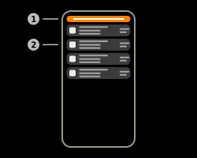

# Wi-Fi Data

This page contains the WiFi-Data entries/devices that have been received in WiFi-Data Northbound packages by the server.

## 1) Filter interface

When this button is pressed, the filter configuration layout will appear. This layout will allow the user to configure different WiFi-Data filters. The filter interface can hold multiple filters of the same and different types.  
Different filter types are compared using AND, e.g. if the filters "Name" and "Mac" are applied, the devices have to fulfill both criteria.  
Identical filter types are compared using OR, e.g. if two filters of the type "Name" are applied, the devices have to fulfill only one of the provided filters.  
Additionally the filter layout of this page also provides two sliders to select the minimum/maximum signal strength (RSSI) values.

|Filter|Usage|Example|
|-|-|-|
|Mac|Local MAC-Address of the WiFi-Device|AA:BB:CC:DD:EE:FF|
|Mac Type|MAC-Address type of the WiFi-Device. This value is retrieved by the Aruba Access Point/sensor.||
|Class|Device class of the WiFi-Device|wifiTag, wifiAssocSta, wifiUnassocSta|
|Client IP|Local IP-Address of the client that sent this package to the server|192.168.100.XX|
|Sensor IP|Local IP-Address of the Aruba Access Point/sensor that reported the device|192.168.100.XX|
|Sensor Mac|Local MAC-Address of the Aruba Access Point(sensor|AA:BB:CC:DD:EE:FF|
|Sensor Name|Local name of the Aruba Access Point/sensor|ap505|

## 2) WiFi-Device item

This item represents a WiFi-Device in range of the device.  
Tap this item to show detailed information on this device.

### a) Class icon

Displays the icon of the current protocol of the WiFi-Device. Supported classes: wifiTag, wifiAssocSta, wifiUnassocSta

### b) Information summary

This view contains the main information of the WiFi-Device. The upper text of this view displays the MAC-Address of the WiFi-Device. The lower text of this view displays the classes of the WiFi-Device, if available.

### c) Transmission strength

Displays the last transmission strength (RSSI) value in dBm.

## Menu items

### Keep screen on

If this checkbox is enabled, the screen of the device will not turn off automatically.

### Documentation

Tap this item to open the documentation of this page.

### Guide

Tap this item to start the interactive guide of this page.