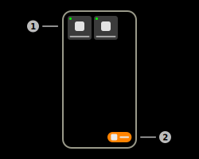
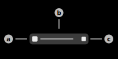

# ZigBee

This feature uses the Aruba IoT-Interface ZigBee functionality to send commands to ZigBee devices in the ZigBee network of the Access Point.

## ZigBee Devices

The app uses "ZigBee Device Objects" in order to save the connection information of a specific device. This feature is comparable to the "BLE-Connect Presets" feature. The app saves the following information in the device object.

|Field|Description|
|-|-|
|Device name|Custom name of the device that was entered by the user.|
|ZigBee Address|8-octet IEEE address of the device that is used to send messages.|
|[ZSD Type](#zigbee-socket-device-types)|Type of the device. The "Type" of a device contains all inbound and outbound sockets and all actions and triggers of them.|
|Reporter-MAC|6-octet MAC address of the Aruba Access Point that should redirect the message to the device|
|Reporter-Radio-MAC|8-octet MAC address of the radio of the Aruba Access Point that should be used to communicate with the device.|

### 1) ZigBee Device item

This item represents a ZigBee device, that is saved in the internal database of the application.
- Tap the item to open the interaction page of the device.  
- Tap and hold the item to display advanced options.

#### a) Live-Indicator

This indicator shows that the connection to the ZigBee device is maintained in the background. This means that inbound messages are still processed and the connection can be resumed at any time. Tap and hold the item and tap "End Session" to close the session. This icon will appear as soon as the interaction page of the device is opened.

#### b) Device Name View

This view displays the custom name of the ZigBee Device item.

#### c) Device Type Icon View

This icon displays the icon of the type of the ZigBee device. The type database has two default types: Default (Devices-Icon), Philips Hue Lamp (Bulb-Icon). All custom types will appear with a question-icon. The icon of each individual type can be resolved via the [types page](#zigbee-socket-device-types).

### 2) Create-Device button

Tap this button to add a new ZigBee device to the internal database of the application. The app will open a dialog to enter the required information of the new ZigBee device. The app also offers the possibility to automatically fill the information when connecting to Philips Hue lamps. Pressing the help button of the "Device ZigBee Address"-field will start the process to resolve the name and ZigBee-Address of a nearby lamp. This procedure requires the "BLE-Connect"-feature as well as the "IoT-Server"-feature, in order to resolve the data.

## ZigBee Socket Device Types

The app uses ZigBee Socket Device Type object in order to save information on the device type of a ZigBee device. A ZSD is the collection of all inbound/outbound sockets used to communicate with the remote device. 

- Inbound sockets receive messages from the ZigBee remote device
- Outbound sockets send messages from the Access Point to the ZigBee device

Types can be shared across multiple/all devices.

> **_Note:_** The default ZSD types can neither be edited, nor deleted as the application requires them in order to work properly.

### 1) ZigBee Socket Device Type item

This item represents a ZSD type. Tap the item to edit the type. Tap and hold the item to clone the type. Drag the item to any side to remove it from the database.

#### a) Type Icon view

This view displays the representative icon of the ZSD type. This icon is also used with ZigBee devices to quickly identify the type.

#### b) Type Name view

This view displays the custom name of the type.

#### c) Type Share button

Tap this button to generate an Aruba Configuration template for this ZSD type. The app is capable of generating configuration template for both Aruba OS and Aruba Instant. These templates can be used to register the ZSD type for the Access Point. This procedure is required as the Access Point only allows inbound/outbound traffic with registered types/sockets.

### 2) Create-Type button

Tap this button to add a new ZSD type to the internal database of the application. The app will open a new page to enter the required information of the type. The type requires a valid name (not empty, unique) in order to be created. This page contains a table that displays all inbound and outbound sockets of the type. Press the add button in the bottom right corner in order to add a new socket to the type.

> **_Note:_** The add button is not available until the last made changes have been saved by using the save button in the bottom right corner.

## ZigBee Socket Device Flows

The app uses ZigBee Socket Device Flow objects in order to simplify the interaction between the user and the remote device. There are two types of "flows":

- Actions: Actions are predefined payloads that can be sent across outbound sockets.
- Triggers: Triggers are invoked by inbound messages and can trigger an action. They can also be configured to only activate upon a specific payload.

> **_Note:_** The default ZSD actions can neither be edited, nor deleted as the application requires them in order to work properly.

### 1) ZigBee Socket Device Flow item

This item represents a ZSD flow. As already mentioned is this flow either an action or a trigger. Tap the item to edit the flow. Tap and hold the item to clone the flow. Drag the item to any side to remove it from the database.

#### a) Flow Type icon

This icon represents the type of the flow.

- Pointer icon: Action
- Bolt icon: Trigger

#### b) Flow Name view

This view displays the custom name of the flow.

#### c) Flow Payload view

This view displays the payload of the flow.

- Actions: The payload will be sent when this action is activiated.
- Triggers: The payload is required for the trigger to be invoked (optional).

### 2) Create-Flow button

Tap this button to add a new flow to the internal database of the application. The app will open a dialog to enter the required information of the flow.

## Generic interaction

The generic interaction page is used to send messages to ZigBee devices that are not third-party devices that are natively supported by the application.

### 1) Action buttons

Every button that is included in this column represents an action that is attached to the [ZSD type](#zigbee-socket-device-types) of the device. Tap any button to invoke the action and send the included payload to the remote device.

### 2) Trigger buttons

Every button that is included in this column represents a trigger that is attached to the [ZSD type](#zigbee-socket-device-types) of the device. Tap any button to configure the trigger.

### 3) Send-Custom-Message button

Tap this button to send a custom message to the remote device. This button will create a dialog that requests the needed information. Required information:

|Field|Description|
|-|-|
|Source Endpoint|ZigBee source endpoint of the message (1 - 255)|
|Destination Endpoint|ZigBee destination endpoint of the message (1 - 255)|
|Destination Profile ID|ZigBee destination profile ID of the message (4-digit hex code, e.g. Home Automation - 0104)|
|Destination Cluster ID|ZigBee destination cluster ID of the message (4-digit hex code, e.g. Basic - 0000)|
|Message payload|Raw hex payload that is sent to the remote device|

#### ZigBee Payload Generator

The integrated "ZigBee Payload Generator" of the application can be used to generate the payload of generic ZigBee message types. Implemented message frames:

|Frame Type|Fields|Description|
|-|-|-|
|On/Off Command|Sequence Number (0 - 255), Command (On, Off, Toggle)|This command is sent to the On/Off Cluster of the ZigBee device. This command can e.g. be used to turn devices on and off.|
|Level Control|Sequence Number (0 - 255), Level (0 - 255)|This command is sent to the Level Control Cluster of the ZigBee device. This command can e.g. be used to change the brightness of a lamp.|
|Color Control|Sequence Number (0 - 255), Command (Move to Color/Temperature/Hue)|This command is sent to the Color Control Cluster of the ZigBee device. This command can e.g. be used to change the color of a RGB lamp.|
|Read Attributes Request|Sequence Number (0 - 255), Attributes (4-digit hex code)|This command can be sent to any cluster and is used to read specific attributes of a cluster. A list of popular clusters and attributes is included in the app.|
|Identify Command|Sequence Number (0 - 255), Duration (0 - 65535)|This command should be sent to the Identify cluster of the ZigBee device. This command can e.g. identifiy a device by letting it flash.|