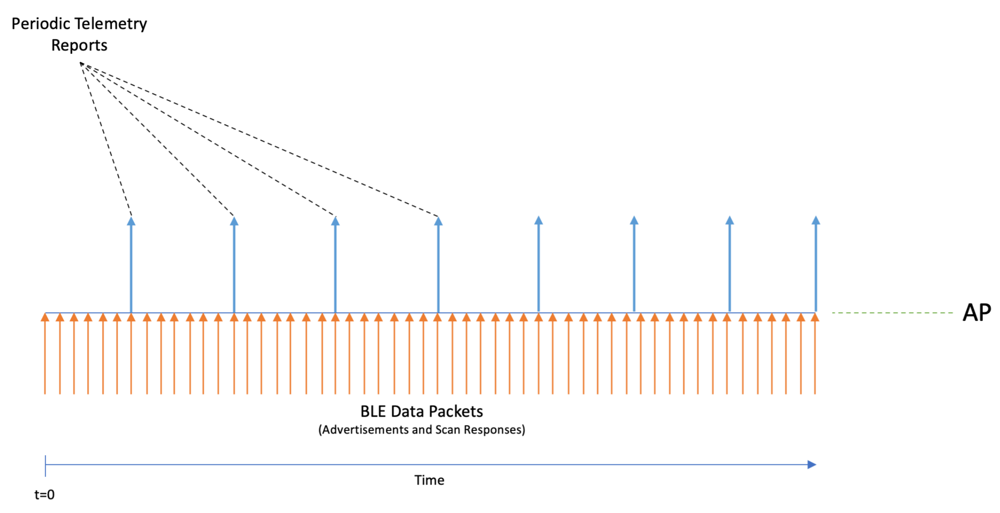
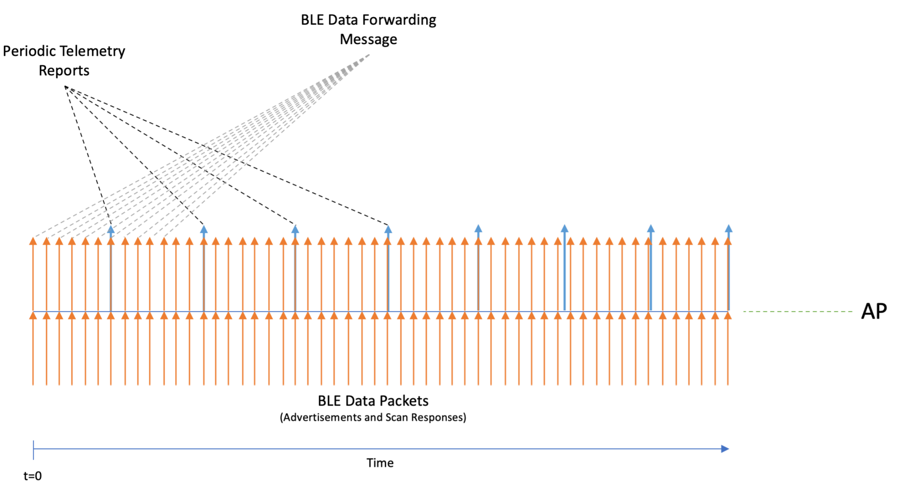

# Aruba IoT concepts and configuration

This chapter describes the principals of the Aruba IoT integrations and configuration using ArubaOS/Aruba Instant version 8.8.0.0 or higher.

[Aruba, a Hewlett Packard Enterprise (HPE) company](https://www.arubanetworks.com/) supports IoT applications based on Wi-Fi (e.g. Wi-Fi tracking), BLE (e.g. asset tracking or sensor monitoring), ZigBee and 3rd party protocols via USB-extension by providing the connection layer using Aruba access points. IoT devices can send/receive data via the Aruba APs built-in radios or supported 3rd party radios connected via USB to 3rd party backend system.


The Aruba AP radios can be used as transmitter/receiver (e.g. BLE connect, ZigBee) or just a receiver/sensor (e.g. BLE asset tracking, Wi-Fi tracking), depending on the respective IoT solution. With that the AP provides a one-way or two-way communication channel between IoT devices (e.g, sensors, actors) and IoT systems.  
The access point works as protocol translational gateway between the different IoT radios/protocols and the Aruba IoT server interface protocol or plain IP protocol depending on the respective IoT solution being used.  

## IoT connectivity (radio-side)

On the radio-side the Aruba access points support different IoT radio technologies either though integrated radios or 3rd party solutions connected to the APs USB port.

### **Wi-Fi**

The Aruba access point Wi-Fi radios can be used to forward associated/unassociated client information and RTLS data for Wi-Fi based tracking use cases. Wi-Fi client and RTLS data is encapsulated in the Aruba IoT server interface protocol and forwarded to the IoT backend system.  

### **Aruba IoT radio**

An Aruba IoT radio is an additional internal or external radio in the Aruba AP-3xx/5xx series access points that can be leveraged for IoT connectivity.  
A single Aruba AP-3xx/5xx series access points can support up to two IoT radios, one internal and one external. This would used cases where one radio could be used for BLE and another for ZigBee for example.  
The access point removes/adds the radio specific headers from/to IoT devices e.g. BLE or ZigBee and forwards/receives the data payload encapsulated in the Aruba IoT server interface protocol to/from the IoT backend system.  

#### ***Integrated***

Aruba AP-3xx/5xx series access points provide an integrated Aruba IoT radio for the IoT connectivity supporting the following radio technologies:

- AP-3xx: BLE4 (Gen1)
- AP-5xx: BLE5/802.15.4 (Gen2) e.g. ZigBee

#### ***External***

In addition to the internal IoT radio Aruba also provides [IoT expansion radio](https://www.arubanetworks.com/assets/ds/DS_IoT-Expansion-Radio.pdf) supports the same radio technologies as the AP-5xx series access points:  

- Aruba IoT Expansion Radio = BLE5/802.15.4 (Gen2) e.g. ZigBee

>***Note:***  
>The internal and the expansion BLE5/802.15.4 (Gne2) IoT radio can be enabled to run in BLE and ZigBee concurrently. But in this case the IoT radio can only transmit but not receive BLE packet, while the ZigBee communication works bi-directional.  
>  
> This allows enabling the APs BLE console as well as BLE beaconing (iBeacon) for indoor navigation use cases in parallel to ZigBee user cases. But BLE tracking uses cases like asset tracking are not supported in this case.  
>  
> In order to support BLE tracking or bi-directional use cases concurrently to ZigBee uses cases on the same access points two Aruba IoT radios Gen2, one internal and one external, are required. Therefore this scenario is currently only supported on the Aruba AP-5xx series access points.

The configuration of the Aruba IoT radios is handled in the [IoT radio profile](#iot-radio-profile) configuration.

### **USB/3rd party IoT radios**

Aruba supports the extension of Aruba access points using USB with supported 3rd party solutions. Depending on the particular solution the integration uses one of the following methods:

- USB-to-serial
- USB-to-ethernet

In all cases the USB connected host system removes/adds the radio specific headers/protocols from/to IoT devices and forwards/receives the data payload to the access point using one of the USB methods.

Supported USB connected devices does not required a specific configuration, except for vendor specific implementations, but it can be controlled which USB devices are allowed to connect to an access points. This can be controlled using the [AP USB device management](#ap-usb-device-management).

#### ***USB-to-serial***

The [3rd party solutions using the USB-to-serial](#supported-usb-vendor-list-for-iot) method forwards the data payload to/from the access point using [serial-data](#serial-data). The Aruba access point encapsulates the serial-data payload in the Aruba IoT server interface protocol to/from the IoT backend system.

>***Note:***  
> No specific configuration is required for USB-to-serial devices. Serial data is only forwarded though the Aruba IoT server interface, if enabled on the server-side.  

#### ***USB-to-ethernet***

The [3rd party solutions using the USB-to-ethernet](#supported-usb-vendor-list-for-iot) method provides ethernet/IP connectivity to the connected USB host system. The USB host system is connected to the access point in the same way as a wired client. No data processing is done by the access point and ethernet/IP data packets form the USB host system is forwarded like any other ethernet/IP traffic.

#### ***Vendor specific implementations***

The following [Vendor specific USB integrations](#supported-usb-vendor-list-for-iot) do not follow the previously mentioned methods and require a dedicated configuration.  
 
- [SES Imagotag Electronic Shelf Labels (ESL)](#ses-imagotag-esl-configuration)

## IoT server connectivity (server-side)

On the server-side IoT data payloads are either forwarded directly by [USB-to-ethernet](#usb-to-ethernet) connected devices using IP transport or using the [Aruba IoT server interface](#aruba-iot-server-interface) providing different transport protocols and data encapsulations.

USB-to-ethernet connectivity only requires applying a [Wired-Port profile](#wired-port-profile) to the APs USB port to give the USB host system ethernet/IP access. The benefit of this approach is that USB host system's network access can be separated from the AP management networks e.g. by assigning a different VLAN and can be controlled using the AP integrated firewall like any other wired client connected to the AP. The USB host system uses its own IP stack with a separate IP address for its communication to the remote IoT system.

>***Note:***  
>Vendor specific USB implementations like *SES Imagotag Electronic Shelf Labels (ESL)* are using IP transport with a [vendor specific configuration](#vendor-specific-implementations).  

### **Aruba IoT server interface**

The **Aruba IoT server interface** is an Aruba proprietary server-side connectivity interface to connect to IoT servers using the Aruba AP's or Aruba controllers management IP address. The interface provide multiple transport protocol and data encapsulation options and is specified in the [Aruba IoT Server Interface Guide](#aruba-iot-server-interface-guide).  
All **Aruba IoT server interface** related aspects are configured in an [iot transport profile](#iot-transport-profile).  

>***Note:***  
Up to 4 iot transport profiles can be concurrently enabled per Aruba Instant AP or ArubaOS AP group.  
> This allows to run up to 4 IoT applications concurrently e.g., Aruba Meridian Beacon Management + Aruba Meridian Asset Tracking + 3rd Party BLE Asset Tracking + EnOcean.

The following chapters describe the **Aruba IoT server interface** related options and services.

### **IoT server connection types**

The Aruba IoT server interface supports vendor specific and generic [IoT server connections](#aruba-iot-server-interface---connection-types).  

The following generic connection types allow IoT data forwarding for the different [IoT connectivity (radio-side)](#iot-connectivity-radio-side) options previously described.

#### ***Telemetry-Https***

The *Telemetry-Https* connection type can be use to send [BLE telemetry](#ble-telemetry) reports in one direction only, from the radio-side to the server-side, using HTTP POST requests.  

This connection type can be used for BLE-based asset tracking or sensor monitoring use cases using easily consumable JSON data.
The JSON data structure is defined in the [Aruba IoT Telemetry JSON Schema](#aruba-iot-telemetry-json-schema).

#### ***Telemetry-Websocket***

The *Telemetry-Websocket* connection type can be used for all supported [IoT transport services](#iot-transport-services) providing a bi-directional communication channel though a web socket (ws) or secure web socket (wss) connection.

Communication via the *Telemetry-Websocket* connection is encoded using the [Google Protocol Buffers serialization protocol](https://developers.google.com/protocol-buffers). Supported messages types (northbound/southbound API) and the encoding and decoding of the data payloads is defined in the [Aruba IoT Protobuf Specification](#aruba-iot-protobuf-specification).

With this connection type is the full set of IoT connection capabilities of an Aruba infrastructure available.

>***Note:***  
>The IoT-Utilities app only supports Telemetry-Websocket connections.

#### ***Azure-IoTHub***

The *Azure-IoTHub* connection type can be use to send/receive [BLE data forwarding](#ble-data-forwarding)/[Serial-data](#serial-data) directly to [Azure IoT Hub](https://docs.microsoft.com/en-us/azure/iot-hub/about-iot-hub) by using the AMPQ over websocket protocol.

With this connection type Aruba controller's or Instant access points work as a protocol translation gateway (in Azure terms) to send data to Azure IoT Hub on behalf of connected IoT devices.

For details please see the [Azure IoT Hub Integration Tech Note](#azure-iot-hub-integration)  

### **Server connection encryption**

Even if un-encrypted HTTP or web socket connectivity is supported by the Aruba IoT server interface, it is recommended to only use encrypted connections to remote IoT systems.  

In order to establish secure web socket (wss) or HTTPS connections the remote server's self-signed certificate or root CA certificate has to be added to the Aruba controller/Instant access points trusted CA list.  

>***Note:***  
>If the IoT server certificate is un-trusted the server connection will not be established.

Please refer to [importing certificates](#importing-certificates) for how to add/import required certificates on the Aruba infrastructure.

>***Note:***  
>The IoT-Utilities app provides a download link on the web dashboard to download the self-signed server certificate. Alternatively a certificate signed by a private or public CA certificate that is trusted by the Aruba infrastructure can be installed into the app.

### **Authentication and authorization**

Depending on the [Aruba IoT server connection type](#aruba-iot-server-interface---connection-types) different authentication and authorization methods are supported/required to establish server-side connections.

Supported authentication and authorization methods are:

- static access token
- username/password
- client_id/secret

Details about the different authentication methods are documented in the [Aruba IoT Server Interface Guide](#aruba-iot-server-interface-guide).

### **Connection management**

Server connections are established form every single Aruba Instant access point, in case of a controller-less setup, or from every Aruba controller in case of a controller-based setup.  

For example, in a controller cluster setup with 4 controllers every controller will establish a connection to the remote server.

>***Note:***  
>In an ArubaOS controller setup the number of server connections equals the number of controllers.  
>  
>In an Aruba Instant setup the number of server connections equals the number of APs.  

In a controller based setup IoT data is forwarded to/from the remote IoT server via the APs active controller only. In case of a failover the IoT communication will also failover to the backup controller's IoT interface connection.  

>***Note***  
>Redundant controller based setups requires proper connection management on the IoT server side for bi-directional communication to continue to work in case of a failover.  
>  
>For details please refer to the [Aruba IoT Server Interface Guide](#aruba-iot-server-interface-guide).

### **IoT transport services**

The Aruba IoT server interface supports different transport services for the IoT communication.

The usage of the specific transport service depends on the used [IoT connectivity](#iot-connectivity-radio-side) and [IoT server connection type](#iot-server-connection-types).

>***Note:***
>Not all transport services are supported with every available IoT server connectivity option.

To enable one or multiple transport services the corresponding supported device class filter has to be enabled in the [iot transport profile](#iot-transport-profile) configuration.

The table below shows a summary of the available transport services:

|IoT transport service|[IoT connectivity](#iot-connectivity-radio-side)|[Supported IoT server connection type](#iot-server-connection-types)|[Device Class Filter](#device-class-filter)|
|-|-|-|-|
|**Wi-Fi**||||
|[Wi-Fi telemetry](#wi-fi-telemetry)|[Wi-Fi](#wi-fi)|[Telemetry-Websocket](#telemetry-websocket)|[wifi-assoc-sta, wifi-unassoc-sta](#wi-fi-device-class-filter)|
|[Wi-Fi RTLS data forwarding](#wi-fi-rtls-data-forwarding)|[Wi-Fi](#wi-fi)|[Telemetry-Websocket](#telemetry-websocket)|[wifi-tags](#wi-fi-device-class-filter)|
|**Bluetooth Low Energy (BLE)**||||
|[BLE Telemetry](#ble-telemetry)|BLE -> [Aruba IoT radio Gen1 or Gen2](#aruba-iot-radio)|[Telemetry-Https](#Telemetry-Https), [Telemetry-Websocket](#telemetry-websocket)|[All BLE device classes](#ble-device-class-filter)|
|[BLE data forwarding](#ble-data-forwarding)|BLE -> [Aruba IoT radio Gen1 or Gen2](#aruba-iot-radio)|[Telemetry-Websocket](#telemetry-websocket), [Azure-IoTHub](#azure-iothub)|[All BLE device classes](#ble-device-class-filter)|
|[BLE connect](#ble-connect)|BLE -> [Aruba IoT radio Gen1 or Gen2](#aruba-iot-radio)|[Telemetry-Websocket](#telemetry-websocket)|[All BLE device classes](#ble-device-class-filter)|
|**USB/3rd party**||||
|[Serial-data](#serial-data)|USB/3rd party -> [USB-to-serial](#usb-to-serial)|[Telemetry-Websocket](#telemetry-websocket), [Azure-IoTHub](#azure-iothub)|[serial-data](#usb3rd-party-device-class-filter)|
|**ZigBee**||||
|[ZigBee Socket Device](#zigbee-socket-device)|[ZigBee -> Aruba IoT radio Gen2](#aruba-iot-radio)|[Telemetry-Websocket](#telemetry-websocket)|[zsd](#zigbee-socket-device-class-filter)|  

>***Note:***  
>For details about the available data with every IoT forwarding mode refer to the [Aruba IoT Server Interface Guide](#aruba-iot-server-interface-guide).

#### **Wi-Fi telemetry**

Wi-Fi telemetry sends periodic reports (northbound only) about all the Wi-Fi devices that are discovered by an AP.

 >***Note:***  
 >For an AP to discover Wi-Fi devices the AP radios has to be enabled and set to *access* or *monitor* mode.

Wi-Fi devices are classified either as:

- associated (*wifi-assoc-sta*)
- unassociated (*wifi-unassoc-sta*)

At every reporting interval the following information are reported:

- station MAC address
- received signal strength (RSSI)
- device class

Wi-Fi telemetry is enabled using the device class [wifi-assoc-sta](#wi-fi-device-class-filter) and/or [wifi-unassoc-sta](#wi-fi-device-class-filter) in the [iot transport profile](#iot-transport-profile) configuration.

>***Note:***  
>WiFi telemetry is only available when using the IoT server connection type [Telemetry-Websocket](#telemetry-websocket).

#### **Wi-Fi RTLS data forwarding**

WiFi RTLS data forwards the wireless data frames that originate from unassociated Wi-Fi tags addressed to a configured RTLS destination MAC address to the remote server.

Wi-fi devices matching this traffic pattern are classified as *wifi-tags*.

The RTLS destination MAC address has to be set in the [iot transport profile](#iot-transport-profile) configuration.

Wi-Fi frames matching the RTLS destination MAC address are immediately forwarded via the IoT server connection (northbound only) to the remote server including the following information:  

- received signal strength (RSSI)
- device class (set to “wifi-tag”)
- payload of the wireless frame

Wi-Fi RTLS data forwarding is enabled using the device class [wifi-tag](#wi-fi-device-class-filter) in the [iot transport profile](#iot-transport-profile) configuration.

>***Note:***  
>WiFi telemetry is only available when using the IoT server connection type [Telemetry-Websocket](#telemetry-websocket).

#### **BLE telemetry**

BLE telemetry sends periodic reports about all BLE devices that are discovered by the AP's [IoT radio](#aruba-iot-radio) to a remote server.  



The AP will continuously listen for advertisements and scan responses and parse/decode these packets for supported BLE protocols. The APs BLE table is updated and reported as BLE telemetry data at the configured report interval.  

>***BLE table limits:***
>
>- max: 512 devices per AP  
>- Oldest entries are deleted first (FIFO)

These telemetry reports contain a summary of all the BLE devices that are seen by a particular AP. For each individual BLE device the supported protocol information will be reported. For unsupported BLE protocols at least the BLE MAC address and the RSSI value are reported.  

An example of these reports and the JSON schema can be found in the [Aruba IoT Telemetry JSON Schema documentation](#aruba-iot-telemetry-json-schema).

BLE telemetry is enabled for the selected [BLE device class](#ble-device-class-filter) in the [iot transport profile](#iot-transport-profile) configuration.

>***Note:***  
>BLE Telemetry is the default data forwarding mode for all BLE device classes and cannot be disabled.

#### **BLE data forwarding**

BLE data forwarding sends all BLE advertisement and scan response frames from [known BLE vendor device classes](#supported-iot-vendordevice-class-list).

BLE data forwarding works by forwarding the raw BLE data packets to the remote server **immediately when they are received** by the AP's [IoT radio](#aruba-iot-radio).



>***Important:***  
>BLE forwarding increase the amount of server-side traffic because a message for every BLE advertisement and scan response from eligible BLE devices is send.  
>Furthermore, BLE data forwarding happens in addition to the periodic telemetry reporting. Both methods happen in parallel.  
Therefore, if BLE data forwarding is the main method for the IoT use case it is recommended to set a high *reporting interval* in the [iot transport profile](#iot-transport-profile).  

BLE data forwarding is enabled for the selected [BLE device class](#ble-device-class-filter) in the [iot transport profile](#iot-transport-profile) configuration.

>***Note:***  
>Starting with ArubaOS/Instant version 8.8 BLE data forwarding is supported for all [known BLE vendor device classes](#supported-iot-vendordevice-class-list), except device class ***all*** or ***unclassified***.

>***Note:***  
>BLE data forwarding is only available when using the IoT server connection type [Telemetry-Websocket](#telemetry-websocket).

#### **BLE connect**

BLE connect provides functions to connect and interact with BLE devices remotely via the Aruba IoT interface using the [BLE GATT profile](https://www.bluetooth.com/bluetooth-resources/intro-to-bluetooth-gap-gatt/).  

This allows IoT server applications to connect to BLE devices via the AP's [IoT radio](#aruba-iot-radio). This service is generic to all BLE devices and is not limited to as specific device class.

>***Note:***  
>An access point can connect to one BLE device at a time using BLE connect. Before connecting to another BLE device an existing connections has to be disconnected.

For details about the available BLE connection functions refer to the [Aruba IoT Server Interface Guide](#aruba-iot-server-interface-guide).  

BLE connect is enabled for the selected [BLE device class](#ble-device-class-filter) in the [iot transport profile](#iot-transport-profile) configuration.

>***Note:***  
>BLE connect is only available when using the IoT server connection type [Telemetry-Websocket](#telemetry-websocket).

#### **Serial-data**

Serial-data forwarding is used to support [3rd party IoT radio solutions](#supported-usb-vendor-list-for-iot) connected via the AP USB port.
When the 3rd party IoT radio is plugged into the USB port, it presents itself as a [USB-to-serial](#usb-to-serial) device to the AP.

The serial data sent by the 3rd party radio to the AP is encapsulated in the Aruba IoT server interface protocol to/from the IoT backend system. The server can also send serial data to the AP, which will be forwarded to the 3rd party device.  

>***Note:***  
>Serial-data forwarding is only available when using the IoT server connection type [Telemetry-Websocket](#telemetry-websocket).

Serial data forwarding is enabled using the device class [serial-data](#usb3rd-party-device-class-filter) in the [iot transport profile](#iot-transport-profile) configuration.

#### **ZigBee socket device**

ZigBee socket device (ZSD) is a generic approach used for enabling ZigBee applications using the [Aruba IoT radio Gen2](#aruba-iot-radio).

>***Note:***  
>The ZigBee based Assa-Abloy solution uses a vendor specific [server connection type](#aruba-iot-server-interface---connection-types) and not the ZSD transport service.

Sending/receiving ZigBee application data using the ZigBee socket device (ZSD) method requires the configuration of one or multiple [ZigBee socket device profiles](#zigbee-socket-device-profile) which define the inbound and outbound sockets used by the respective ZigBee application.  

- inbound sockets: receiving data from ZigBee devices
- outbound sockets: sending data to ZigBee devices

A ZigBee socket profile definition consists of four items:  

- source-endpoint
- destination-endpoint
- profile ID
- cluster ID

Different ZigBee services have different socket definitions, may be even for inbound and outbound connections.  

Only the [Aruba IoT radios Gen2](#aruba-iot-radio) support working as coordinator in a ZigBee network. The [ZigBee service profile](#zigbee-service-profile) defines the ZigBee network parameter.

ZigBee socket device (ZSD) is enabled using the device class [zsd](#zigbee-socket-device-class-filter) in the [iot transport profile](#iot-transport-profile) configuration. In addition one or multiple [ZigBee socket device profiles](#zigbee-socket-device-profile) have to be defined and assigned in the [iot transport profile](#iot-transport-profile) configuration.

>***Note:***  
>ZigBee socket device (ZSD) is only available when using the IoT server connection type [Telemetry-Websocket](#telemetry-websocket).

### **Device Class Filter**

Device class filters are used to enabled specific [IoT transport services](#iot-transport-services) over an [IoT server connection](#iot-server-connectivity-server-side) and to control the amount of IoT data transferred on an Aruba infrastructure by using input/output filtering.

Every device class applies to a specific input filter on the IoT connectivity (radio-side) e.g., filtering BLE devices added to the BLE table and an output filter on the IoT server-side connection e.g., filtering which IoT data is forwarded to the remote server.

>***Note:***  
>Concurrent input/output filtering can be disabled if required. In that case for example an AP could hold all seen BLE devices in its BLE table but only reports specific BLE devices to the remote server determined by the output filter. Please refer to the [Aruba IoT documentation](#aruba-reference-documentation) for details.  

Multiple [supported device classes](#supported-iot-vendordevice-class-list) can be enabled in the [iot transport profile](#iot-transport-profile) configuration to enable multiple [IoT transport services](#iot-transport-services) over a single server connection.

>***Note:***  
>A maximum of 16 devices classes can be enabled per iot transport profile.

Device class filter are grouped into the following categories.

#### **BLE device class filter**

For every supported BLE device vendor, identified by the [Bluetooth SIG member list](https://www.bluetooth.com/specifications/assigned-numbers/company-identifiers/), a dedicated [BLE device class](#supported-iot-vendordevice-class-list) is defined.
One ore more BLE device classes can be selected in an [iot transport profile](#iot-transport-profile) to enable [IoT transport services](#iot-transport-services) for the respective BLE vendor.

The special device class ***unclassified*** enables [BLE telemetry](#ble-telemetry) reporting for unknown/unsupported BLE vendor devices.  

The special device class ***all*** enables [BLE telemetry](#ble-telemetry) reporting for all BLE device classes including unclassified BLE devices.

#### **Wi-Fi device class filter**

The device class ***wifi-assoc-sta*** and ***wifi-unassoc-sta*** enables the [Wi-Fi telemetry](#wi-fi-telemetry) transport service.

The device class ***wifi-tag*** enables the [Wi-Fi RTLS data forwarding](#wi-fi-rtls-data-forwarding) transport service.

#### **USB/3rd party device class filter**

The device class ***serial-data*** enables the [serial-data forwarding](#serial-data) to support [3rd party IoT radio solutions](#supported-usb-vendor-list-for-iot)

#### **ZigBee socket device class filter**

The device class ***zsd*** enables the [ZigBee socket device](#zigbee-socket-device) transport service to enable ZigBee applications.

### **Data content filters**

In addition to filter for specific [device classes](#device-class-filter) it possible to filter the forwarded IoT data content before being sent to the remote Iot system.

#### **General data filter**

-   ***Data Filter***  
This is a list of data fields to be suppress in the telemetry reports. The data filter is a string that is a comma separated list of index-paths. Each index path refers to the field numbers in the [Aruba IoT Protobuf Specification](#aruba-iot-protobuf-specification). For example, the value  “3.3, 3.12” would suppress the ‘reported.model’ field and the ‘reported.beacons’ field in the telemetry reports.  

-   ***Device Count***  
Only sends the count of device types, e.g. iBeacon, Wi-Fi clients, seen by an AP in the telemetry reports, but not the actual device information of those devices. Supported device counts are defined in the [Aruba IoT Protobuf Specification](#aruba-iot-protobuf-specification).

#### **BLE data filter**

-   ***RSSI Reporting Format***  
For the BLE RSSI values being send in the telemetry reports five different RSSI reporting formats are supported. The four reporting
formats are:
    -   **Average** - The average RSSI over the reporting interval will be reported.  
    -   **Last** -  Only the last RSSI value that was seen by the device will be reported.  
    -   **Max** - The max RSSI value that was seen over the reporting interval will be reported only. This max value resets each telemetry reporting interval and will be updated accordingly.  
    -   **Bulk** - The last 20 RSSI values that were seen by the device since the previous telemetry report will be reported in an array format.  
    -   **Smooth** -  A single smoothed out RSSI value will be reported for each telemetry report. This is done by attempting to remove outliers from the RSSI values received by the AP.  

-   ***Environment Type***  
Five different pre-defined environment types are supported to help adjust RSSI based distance calculation to better fit the environment in which the BLE devices are operating in. For best results, the value that closest corresponds to the environment in which BLE is operating should be chosen.  
    -   **auditorium**
    -   **office**
    -   **outdoor**
    -   **shipboard**
    -   **warehouse**
    -   **custom** (see custom fading factor for details)

-   ***Custom Fading Factor***  
If the pre-defined environment type offsets do not properly fit the environment, a custom fading factor can be configured by setting the environment type to ***custom***. This field accepts integer values in the range of 10 to 40.  

-   ***Cell Size Filter***  
A proximity-based filter that will only report devices that are found to be within an “x” meter radius around the access point. This distance is calculated with an algorithm based off the RSSI value. The default value for this field is “0”, which translates to the cell size filter being disabled. This field accepts integer values from 2 to 100 and the units are meters.  

-   ***Movement Filter***  
This filter is active when the cell size filter is also configured. When this filter is enabled, devices will only be reported if the difference between their current and prior distance is more than the configured filter value. For example, if the movement filter is configured to be 2 meters, a device that is calculated to have moved 1 meter will not be reported, while a device that moves 5 meters will be reported. The default value for this field is “0”, which corresponds to the movement filter being disabled. This field accepts integer values from 2 to 30, and the units are meters.  

-   ***Age Filter***  
The Age Filter is used to only report devices the AP has received an update (either BLE advertisement or scan response) in the configured time. For instance, if the age filter is set to 30 seconds, only devices which have been heard in the last 30 seconds will be reported. If there is a device that received an update 45 seconds before, this device will not be reported. The default value for this field is “0”, which corresponds to the age filter being disabled. This field accepts integer values from 30 to 3600, and the units are seconds.  

-   ***BLE Vendor Filter***  
The BLE Vendor Filter allows to input either [Bluetooth SIG Vendor IDs](https://www.bluetooth.com/specifications/assigned-numbers/company-identifiers/) or freeform vendor name strings, which will be used to filter the devices being reported. If this is configured, the only devices that will be reported are the devices that match the configured Vendor ID or Vendor Name.  

-   ***UUID Filter (iBeacon)***  
A list of UUIDs to filter the devices included in the reports. Applies only to iBeacon devices.

-   ***UID Namespace Filter (Eddystone)***  
A list of UID namespaces to filter devices included in the reports. Applies only Eddystone-UID devices

-   ***URL Filter (Eddystone)***  
A list of URL strings to filter devices included in the reports. Applies only Eddystone-URL devices. The string listed here can be a partial URL strings.

-   ***BLE data forwarding - per frame filtering***  
When [BLE data forwarding](#ble-data-forwarding) is enabled, the raw payload contained within a BLE packet is forwarded to the configured server. The per frame filtering knob is a modifier on top of the BLE data forwarding knob. When only BLE data forwarding is enabled, all BLE packets for a device having a known device class filter label are forwarded.  
For example: If a device advertises an iBeacon frame and an Eddystone frame and in the [transport profile](#iot-transport-profile) the ***iBeacon*** device class has been selected only, then for this device both iBeacon and Eddystone frames are forward.  
If per frame filtering is enabled in addition to the BLE data forwarding , then only the raw payloads from the iBeacon frames will be forwarded.  

# Configuration

In this chapter the ArubaOS/Aruba Instant configuration steps are described to setup the Aruba infrastructure for IoT solutions.

The configuration of Aruba IoT integrations consists of two main steps:

1. IoT radio-side configuration
2. IoT server-side configuration

Depending on respective IoT solution different configuration settings are required.  

In the table below the required configuration items for step 1 and step 2 per IoT solution are listed:

|IoT solution|Step 1) [IoT radio-side](#iot-connectivity-radio-side) configuration|Step 2) [IoT server-side](#iot-server-connectivity-server-side) configuration|
|-|-|-|
|Wi-Fi solutions|Enable Wi-Fi radios (access or monitor mode)|[iot transport profile](#iot-transport-profile)|
|BLE solutions|[iot radio profile](#iot-radio-profile)|[iot transport profile](#iot-transport-profile)|
|ZigBee solutions|[iot radio profile](#iot-radio-profile) + [zigbee service profile](#zigbee-service-profile) + [zigbee socket device profile](#zigbee-socket-device-profile)|[iot transport profile](#iot-transport-profile)|
|USB/3rd party: USB-to-serial solutions|(optional) [USB ACL profile](#usb-acl-profile)/[USB profile](#usb-profile)|[iot transport profile](#iot-transport-profile)|
|USB/3rd party: USB-to-ethernet solutions|(optional) [USB ACL profile](#usb-acl-profile)/[USB profile](#usb-profile)|[Wired-Port profile](#wired-port-profile)|
|USB/3rd party: SES Imagotag ESLs|(optional) [USB ACL profile](#usb-acl-profile)/[USB profile](#usb-profile) + [SES Imagotag ESL configuration](#ses-imagotag-esl-configuration)|[SES Imagotag ESL configuration](#ses-imagotag-esl-configuration)|

>***Note:***  
>The IoT radio settings for USB/3rd party radios are controlled on the 3rd party system, if any, and there is no configuration required on the Aruba side. The only exception is the [SES Imagotag ESL configuration](#ses-imagotag-esl-configuration) which controls the ESL radio channel.  
>
>Which USB device are allowed to connect to an access point can be controlled using the [AP USB device management](#ap-usb-device-management).

## IoT radio profile

`iot radio-profile`'s are used to configure the [Aruba IoT radio](#aruba-iot-radio) mode, BLE and/or ZigBee, and the respective mode settings. An `iot radio-profile` can either be applied to an internal or external radio instance.  

The `iot radio-profile` also controls the AP' BLE console settings.

The following table lists the available `iot radio-profile` parameters and their description:

|ArubaOS|Aruba Instant|Description|
|-|-|-|
|`iot radio-profile <iot-profile-name>`|`iot radio-profile <iot-profile-name>`|**Name** of the radio profile|
|`radio-instance <internal, external>`|`radio-instance <internal, external>`|**Type** of the radio the profile applies to.<br>Available options are:<br> - ***internal*** - applies to the internal radio of the AP (default) <br>- ***external*** - applies to the external radio that is connected over the USB port of the AP|
|`radio-firmware <firmware>`|`radio-firmware <firmware>`|Firmware that is applied to the radio.<br>Available options:<br>- ***default*** - default firmware gets applied|
|`radio-mode <mode>`|`radio-mode <mode>`|Radio mode to be enabled.<br> Available options are:<br>- ***None*** - Radio disabled (default)<br>- ***ble*** - BLE (tx/rx) enabled<br>- ***zigbee*** - ZigBee enabled<br>- ***"ble zigbee"*** - BLE (tx-only) and ZigBee enabled concurrently|
|`ble-opmode <opmode>`|`ble-opmode <opmode>`|BLE operation mode to be enabled.<br> This parameter is available only when `radio-mode` is set to ***ble*** or ***"ble zigbee"***.<br> Available options are:<br>- ***beaconing*** - BLE (tx) beaconing enabled using the iBeacon protocol (default)<br>- ***scanning*** - BLE (rx) scanning enabled<br>- ***"beaconing scanning"*** - BLE (tx/rx) beaconing and scanning enabled concurrently (default - does not show up in the configuration!)|
|`ble-console <console-mode>` |`ble-console <console-mode>`|BLE console mode to be enabled.<br>BLE console provides console access to the AP over BLE.<br>This parameter is available only when `radio-mode` is set to ***ble*** or ***"ble zigbee"***.<br>Available options are:<br>- ***dynamic*** - Enables BLE console automatically<br>- ***on*** - BLE console enabled<br>- ***off*** - BLE console disabled (default)|
|`ble-txpower <txpower>`|`ble-txpower <txpower>`| BLE tx power in dBM to be used.<br> This parameter is available only when `radio-mode` is set to ***ble*** or ***"ble zigbee"***.<br>- Value range: ***-20 ... 4***, ***0*** is the default value|
|`zigbee-opmode <opmode>`|`zigbee-opmode <opmode>`|ZigBee operation mode to be used.<br> This parameter is available only when `radio-mode` is set to ***zigbee*** or ***"ble zigbee"***.<br> Available options are:<br>- ***coordinator*** - Radio works as ZigBee coordinator (default)|
|`zigbee-channel <channel>`|`zigbee-channel <channel>`|Channel to be used.<br> This parameter is available only when `radio-mode` is set to ***zigbee*** or ***"ble zigbee"***.<br> Available options are:<br>- **auto** - Selects the channel automatically (default)<br>- ***Value range: 11 ... 26*** - Specifies the channel manually|

>***Additional CLI parameters:***  
>
>- `clone` - Copy data from another `iot radio profile` (ArubaOS only)
>- `no` - Delete a command from the profile

>***Note:***  
>The default `ble-opmode beaconing scanning` does not show up in the configuration. Using the ***"beaconing scanning"*** parameter is only required to change the configuration form `ble-opmode beaconing` or `ble-opmode scanning` back to the default.  
>
>If the `radio-mode` is set to ***"ble zigbee"*** only BLE (tx) beaconing is supported, regardless of the `ble-opmode` setting.

An `iot radio-profile` is enabled using the following command:

|ArubaOS|Aruba Instant|
|-|-|
|`iot useTransportProfile <iot-profile-name>`|`iot use-radio-profile <iot-profile-name>`|

In addition to enabling the `iot radio-profile` it has to be assigned to an AP group in ArubaOS/controller based deployments using the following configuration:

    ap-group <ap-group-name>
        iot radio-profile <iot-profile-name>

For details about the `ap-group` configuration refer to the [ArubaOS CLI Reference - ap-group](#aruba-cli-reference---ap-group).

>***Note:***  
>Multiple `iot radio-profile`'s can be configured but a **maximum of two**, one internal and one external can be **enabled** per access point (Aruba Instant) or access point group (ArubaOS).

## IoT transport profile

The `iot transport profile` defines the [IoT server connectivity](#iot-server-connectivity-server-side) settings using the [Aruba IoT server interface](#aruba-iot-server-interface-guide).

The following table lists the available `iot transport profile` parameters and their description:

|ArubaOS|Aruba Instant|Description|
|-|-|-|
|`iot transportProfile <transport-profile-name>`|`iot transportProfile <transport-profile-name>`|**Name** of the transport profile|
|**Server connection settings**||
|`serverType <type>`|`endpointType <type>`|The type of IoT server the transport profile connects to.<br> Available options are listed in the table [Aruba IoT server interface - connection types](#aruba-iot-server-interface---connection-types).<br>The default type is ***Meridian-Beacon-Management***.
|`serverURL <URL>`|`endpointURL <URL>`|IoT server connection ***URL*** used to connect to the remote server.<br> This parameter is not available when Server type is set to ***Azure-IoTHub***.<br> Valid input values have to start with:<br>- ***http(s)://*** - for server connection type [Telemetry-https](#telemetry-https) using HTTP (un-encrypted) or HTTPS(encrypted) connections<br>- ***ws(s)://*** for server connection type [Telemetry-Websocket](#telemetry-websocket) using web socket (ws) or secure web socket (wss) connections|
|`proxy server <ip/fqdn>`<br>`[proxy user <username> password <password>]`|`proxyserver <ip/fqdn> <port> [<username> <password>]`|Configures an optional proxy server to be used to establish the IoT server connection through. Optional proxy server authentication with username/password is supported.<br> Available options are:<br>- ***ip/fqdn*** - Proxy server ip address or full qualified domain name<br> - ***port*** - Proxy server port<br>- ***username*** - Proxy authentication username<br>- ***password*** - Proxy authentication password|
|n/a|`vlan <vlanid>`|Configures the uplink VLAN being used for IoT server connectivity. Only supported on Aruba Instant.<br>Available options:<br>- ***vlan id*** - VLAN id of uplink VLAN|
|**Reporting frequency settings**|||
|`reportingInterval <seconds>`|`transportInterval <seconds>`|Configures the ***reporting interval (in seconds)*** for [IoT transport services](#iot-transport-services) and vendor specific connections that support periodic reporting.<br> The valid/supported value range depends on the configured `serverType/endpointType` and is listed in [Aruba IoT server interface - connection types](#aruba-iot-server-interface---connection-types).|
|**Authentication/Authorization settings**|||
|`authentication-mode <mode>`|`authentication-mode <mode>`|Configures the OAuth2 authentication mode to be used for the server connection.<br>Available options are:<br>- ***none*** - Authentication is disabled and a static access token is used for authorization(default)<br>- ***password*** - Authentication using username/password<br> - ***client-credentials*** - Authentication using client_id/client secret|
|`authenticationURL <URL>`|`authenticationURL <URL>`|Configures the authentication server URL.<br>This parameter only applies if `authentication-mode` is set to ***password*** or ***client-credentials***.<br>Only encrypted connections are allowed starting with **https://**.|
|`accessToken <token>`|`endpointToken <token>`|Configures the static access token used for authorization.<br>This parameter is only applicable when `authentication-mode` is set to ***none***.<br>Input values:<br> - ***token*** - String, base64 characters only.|
|`clientID <client_id>`|`endpointID <client_id>`|Client identifier string that is used by the IoT server to identify the connecting Aruba infrastructure.<br>This parameter only applies if `serverType/endpointType` is set to ***Meridian-Asset-Tracking***, ***[Telemetry-Https](#telemetry-https)*** or ***[Telemetry-Websocket](#telemetry-websocket)***.<br>This parameter is required when `authentication-mode` is set to ***client-credentials*** for OAuth2 client_id/secret authentication.<br>Input values:<br> - ***client_id*** - string, 1-100 characters|
|`client-secret <password>`|`client-secret <client-secret>`|Configures the ***password*** for Oauth2 client_id/secret authentication.<br>This parameter is required when `authentication-mode` is set to ***client-credentials***.|
|`username <username>`|`username <username>`|Configures the ***username*** for username/password authentication.<br>This parameter only applies if `authentication-mode` is set to ***password***.|
|`password <password>`|`password <password>`|Configures the ***password*** for username/password authentication.<br>This parameter only applies if `authentication-mode` is set to ***password***.|
|`accessID <assa-abloy-access-id>`|`accessID <assa-abloy-access-id>`|Configures the Assa-Abloy ***accessID*** for the vendor specific connection type ***Assa-Abloy***.<br>This parameter only applies if `serverType/endpointType` is set to ***Assa-Abloy***.<br>In addition the configuration of the parameters `username` and `password` is required.|
|`azure-dps-auth-type group-enrollment symmetric-key <key>`|`azure-dps-auth-type group-enrollment symmetric-key <key>`| Configures the authentication type and credentials for the Azure Device Provisioning Service (DPS). Currently the only supported authentication type is ***group-enrollment*** using a ***symmetric-key***.<br>Available options are:<br>- ***key*** - Azure symmetric group key.<br>Requires the configuration of parameter `azure-dps-id-scope`.<br>This parameter only applies if `serverType/endpointType` is set to ***[Azure-IoTHub](#azure-iothub)***.|
|`azure-dps-id-scope <scope-id>`|`azure-dps-id-scope <scope-id>`|Configures the Azure Device Provisioning Service (DPS) enrollment group  ***scope-id***.<br>Available options are:<br>- ***scope-id*** - Azure DPS enrollment group scope-id.<br>Requires the configuration of parameter `azure-dps-auth-type`.<br>This parameter only applies if `serverType/endpointType` is set to ***[Azure-IoTHub](#azure-iothub)***.|
|**Device filter settings**||
|`deviceClassFilter <device-class>`|`payloadContent <device-class>`|Configures a list of [supported device classes](#supported-iot-vendordevice-class-list) to be included in telemetry reports or data forwarding to the remote IoT server. For details see [Device Class Filter](#device-class-filter).<br>A maximum of 16 devices classes can be enabled per iot transport profile.|
|**Wi-Fi specific settings**|||
|`rtlsDestMAC <MAC-address>`|`rtlsDestMAC <MAC-address>`|Sets the destination MAC address filter for RTLS tags device class.<br>This parameter only applies if `serverType/endpointType` is set to ***[Telemetry-Websocket](#telemetry-websocket)*** and the `deviceClassFilter` ***[wifi-tag](#wi-fi-device-class-filter)*** is selected to enable the [Wi-Fi RTLS data forwarding](#wi-fi-rtls-data-forwarding) transport service.|
|**ZigBee specific settings**|||
|`ZSDFilter <zigbee-socket-device-profile>`<br>`...`<br>`ZSDFilter <zigbee-socket-device-profile>`|`ZSDFilter <zigbee-socket-device-profile>,...,<zigbee-socket-device-profile>`|Assigns a list of [zigbee-device-socket-profiles](#zigbee-socket-device-profile) to filter the allowed zigbee socket devices (ZigBee applications) forwarded by the transport profile.<br>This parameter only applies if `serverType/endpointType` is set to ***[Telemetry-Websocket](#telemetry-websocket)*** and the `deviceClassFilter` ***[zsd](#zigbee-socket-device-class-filter)*** is selected to enable the [ZigBee socket device](#zigbee-socket-device) transport service.|
|[**General data content filter settings**](#general-data-filter)
|`data-filter <data-id-list>`|`data-filter <data-id-list>`|Configures a list of data points to filter from periodic telemetry reports before sending to the remote IoT server. The data fields refer to the field numbers in the [Aruba IoT Protobuf Specification](#aruba-iot-protobuf-specification).<br>This parameter only applies to [IoT transport services](#iot-transport-services) that support periodic reporting.|
|`deviceCountOnly`|`deviceCountOnly`|Enables to send only the aggregated device type counts per configured [device class](#device-class-filter).<br>This parameter only applies to [IoT transport services](#iot-transport-services) that support periodic reporting.||
|[**BLE data content filter settings**](#ble-data-filter)||<br>These parameters only apply to BLE related [device classes](#ble-device-class-filter) and [transport services](#iot-transport-services) and if `serverType/endpointType` is set to ***[Telemetry-Https](#telemetry-https)***, ***[Telemetry-Websocket](#telemetry-websocket)*** or ***[Azure-IoTHub](#azure-iothub)***|
|`rssiReporting <format>`|`rssiReporting <format>`|Set the preferred RSSI format BLE telemetry reporting.<br>Available options are:<br> - ***average*** - RSSI averaged over the reporting period (default)<br> - ***bulk*** - Last 20 RSSI values seen by the device since the previous reporting interval <br> - ***last*** - Last RSSI value seen by the device<br> - ***max*** - Maximum RSSI measured over the reporting period<br> - ***smooth*** - Smoothed RSSI measured over the reporting period|
|`environmentType <type>`|`environmentType <type>`|Set the working environment type for RSSI based BLE distance calculation..<br>Available options are:<br> - ***auditorium*** - Auditorium environment<br> - ***custom*** - Custom environment, set custom fading factor using `customFadingFactor`<br> - ***office*** - Office environment (default)<br> - ***outdoor*** - Outdoor environment<br> - ***shipboard*** - Shipboard environment<br> - ***warehouse*** - Warehouse environment|
|`customFadingFactor <factor>`|`customFadingFactor <factor>`|This parameter sets a custom fading factor the BLE distance calculation.<br>This parameter only applies if `environmentType` is set to ***custom***.<br>Input values:<br>**Range**: *10-40*|
|`cellSizeFilter <cellsize>`|`cellSizeFilter <cellsize>`|Sets a proximity filter specified in meters. Devices outside the cell will not be reported.<br>Setting to *0* disables the cell size filter.<br>**Range**:<br> - Aruba Instant: *0 to 255 m*<br> - ArubaOS: *2 to 100 m*<br>**Default**: *0*|
|`movementFilter <threshold>`|`movementFilter <threshold>`|Filters devices that do not change distance. Specified in meters.<br>Applicable only if a `cellSizeFilter` is set.<br>Setting to *0* disables the movement filter.<br>**Range**:<br> - Aruba Instant: *0 to 255 m*<br> - ArubaOS: *2 to 30 m* m<br>**Default**: *0*|
|`ageFilter <timeout>`|`ageFilter <timeout>`|Sets a timeout for inactive devices. Devices without activity in the specified time frame will not be reported.<br>Setting to *0* disables the ageFilter filter.<br>**Range**: *30 to 3600 seconds*<br>**Default**: *0*|
|`vendorFilter <vendor-list>`|`vendorFilter <vendor-list>`|Specifies a list of [Bluetooth SIG vendor IDs or vendor names](https://www.bluetooth.com/specifications/assigned-numbers/company-identifiers/). Only devices that match the configured Vendor ID or Vendor Name will be reported.<br>Input value:<br> - **vendor-list** - max 5 vendor IDs or vendor names, example: *"0x011B,0x004C,Google"*|
|`uuidFilter <uuid-list>`|`uuidFilter <uuid-list>`|Specifies a list of ***iBeacon UUIDs*** to filter devices included in the reports.<br>This parameter only applies if the `deviceClassFilter` is set to ***[ibeacon](#ble-device-class-filter)***.<br>Input value:<br> - **uuid-list** - max 10 UUIDs, example: *"xxxxxxxx-xxxx-xxxx-xxxx-xxxxxxxxxxxx,yyyyyyyy-yyyy-yyyy-yyyy-yyyyyyyyyyyy"*|
|`uidNamespaceFilter <uid-list>`|`uidNamespaceFilter <uid-list>`|Specifies a list of ***Eddystone-UID namespaces*** to filter devices included in the reports.<br>This parameter only applies if the `deviceClassFilter` is set to ***[eddystone](#ble-device-class-filter)***.<br>Input value:<br> - **uid-list** - max 10 UUIDs, example: *"707cc5b4983477cb3e77,707cc5b49883477cb3e7"*|
|`urlFilter <url-list>`|`urlFilter <url-list>`|Specifies a list of ***Eddystone-URL*** strings to filter devices included in the reports.<br>This parameter only applies if the `deviceClassFilter` is set to ***[eddystone](#ble-device-class-filter)***.<br>Input value:<br> - **url-list** - max 10 URLs, partial URL strings are allowed, example: *"https://www.arubanetworks.com/iot,https://www.hpe.com"*|
|`bleDataForwarding`|`bleDataForwarding`|Enable [BLE data forwarding](#ble-data-forwarding) for all known [BLE device classes](#ble-device-class-filter).<br>**Default**: *disabled*|
|`perFrameFiltering`|`perFrameFiltering`|Enables [per frame BLE data filtering](#ble-data-filter). If this option is enabled the transport profile filters are applied to each BLE frame rather than on the BLE device as a whole.<br>This parameter only applies if `bleDataForwarding` is enabled.<br>**Default**: *disabled*|
|**AP-group assignment**|||
|`include-ap-group <ap-group>`|n/a|Applies one ore multiple AP groups to the transport profile.<br>Only supported on ArubaOS.<br>Required input values:<br>- ***ap-group*** - AP group name|

>***Additional CLI parameters:***  
>
>- `clone` - Copy data from another `iot transport profile` (ArubaOS only)
>- `no` - Delete a command from the profile

An `iot transportProfile` is enabled using the following command:

|ArubaOS|Aruba Instant|
|-|-|
|`iot useTransportProfile <transport-profile-name>`|`iot useTransportProfile <transport-profile-name>`|

>***Note:***  
>Multiple transport profiles can be configured, but a maximum of 4 transport profiles can be enabled per access point (Aruba Instant) or access point group (ArubaOS).

## AP USB device management
  
AP USB device management controls connected USB devices using USB profiles and USB ACL profiles. An USB ACL profile is assigned to an AP or AP group using an USB profile.

### USB ACL profile

An USB ACL profile consists of one or more permit/deny rules for supported USB vendor-product names. An USB ACL profile includes an implicit *deny-all* at then end. An USB profile with an undefined USB ACL profile applies a *permit-all* by default.

>***Note:***  
>Up to 16 USB ACL profiles are supported.

|ArubaOS|Aruba Instant|Description|
|-|-|-|
|`ap usb-acl-prof <usb-acl-profile-name>`|`usb acl-profile <usb-acl-profile-name>`|**Name** of the USB ACL profile|
|`rule vendor <vendor-name> action <permit/deny>`|`rule <vendor-name> <permit/dena>`|Configure an ACL rule for a supported USB ***vendor-name***.<br>Available options are:<br> - ***vendor-name*** - USB vendor name, ***All*** allows all supported vendors<br><br>Available action value to perform if the vendor-name matches.<br>Available options are:<br> - ***deny*** - Access to USB device is denied<br> - ***permit*** - Access to USB device is refused

>***Note:***  
>The `show usb supported vendor-product` command lists the supported USB vendor-names on Aruba Instant APs.

### USB profile

An USB profile binds a specific USB ACL profile ton an AP or AP group.

|ArubaOS|Aruba Instant|Description|
|-|-|-|
|`ap usb-profile <usb-profile-name>`|`usb profile <usb-profile-name>`|**Name** of the USB profile|
|`usb-acl-profile <usb-acl-profile-name>`|`usb-acl <usb-acl-profile-name>`|Assigns an previously defined USB profile to the USB profile.<br>Available options are:<br> - ***usb-acl-profile-name*** - Name of the USB ACL profile|

An USB profile is bound to an AP or AP group using the following commands:

**ArubaOS**

```
ap-group <ap-group-name>
    usb-profile <usb-profile-name>
```

For details about the `ap-group` configuration refer to the [ArubaOS CLI Reference - ap-group](#aruba-cli-reference---ap-group).

**Aruba Instant**

```
usb-profile-binding <usb-profile-name>
```

For details about the `usb-profile-binding` configuration refer to the [Aruba CLI Reference - USB profile binding](#aruba-cli-reference---usb-profile-binding).

Examples:

**ArubaOS**

```
ap usb-acl-prof "UsbAclProf1"
    rule vendor All action permit
!
ap usb-profile "UsbProf1"
    usb-acl-profile "UsbAclPro1"
!
ap-group "ApGroup1"
    usb-profile "UsbProf1"
!
```

**Aruba Instant**

```
usb acl-profile "UsbAclProf1"
 rule  All  permit
exit
usb profile "UsbProf1"
 usb-acl "UsbAclProf1"
exit
usb-profile-binding "UsbProf1"
```

## Wired-Port profile

**Aruba Instant**

```
```

Examples:

**ArubaOS**

```
ap wired-ap-profile "USB-to-ethernet-wiredApProf1"
    forward-mode bridge
    switchport access vlan 192
    wired-ap-enable
!
ap wired-port-profile "USB-to-ethernet-wiredPortProf1"
    wired-ap-profile "USB-to-ethernet-wiredApProf1"
!
ap-group "IoT-1"
    enet-usb-port-profile "USB-to-ethernet-wiredPortProf1"
!
```

**Aruba Instant**

```
wired-port-profile USB-to-ethernet-wiredPortProf1
 switchport-mode access
 allowed-vlan 100
 native-vlan 100
 no shutdown
 type employee
exit
enet-usb-port-profile USB-to-ethernet-wiredPortProf1
```

## ZigBee service profile

```

```

## ZigBee socket-device-profile

```

```


## SES Imagotag ESL configuration

Examples:

**ArubaOS**

```
sesimagotag-esl-profile
 sesimagotag-esl-serverip 192.168.100.53
 sesimagotag-esl-channel 3
```

**Aruba Instant**

```

```

# Configuration Examples

```

```

## Wi-Fi solutions

```

```

### Wi-Fi client tracking

```

```

### Wi-Fi RTLS

```

```

## BLE solutions

```

```

### Aruba Meridian Beacon Management

```

```

### Aruba Meridian Asset Tracking

```

```

### ZF Openmatics

```

```

### BLE telemetry (e.g. HYPROS, PnT, ...)

```

```

### BLE data forwarding (e.g. Minew, Google, ...)

```

```

### BLE connect (e.g. ABB)

```

```

## Zigbee (e.g. ASSA ABLOY)

```

```

## USB/3rd party radio solutions

```

```

### SES Imagotag

```

```

### USB-to-ethernet (e.g.Solu-M, Hanshow, AmberBox, ...)

```

```

### USB-to-serial (e.g. EnOcean, Piera Systems, ...)

```

```

# Appendix

## Aruba Reference Documentation

*  [ArubaOS Online Documentation](https://www.arubanetworks.com/techdocs/ArubaOS_8.8.0_Web_Help/Content/home.htm)
*  [Aruba Instant Online Documentation](https://www.arubanetworks.com/techdocs/Instant_88_WebHelp/Content/homeinstant.htm)
*  [Aruba CLI Reference](https://www.arubanetworks.com/techdocs/CLI-Bank/Content/Home.htm)

### Aruba CLI Reference - ap-group

-   [ArubaOS CLI Reference - ap-group](https://www.arubanetworks.com/techdocs/CLI-Bank/Content/aos8/ap-group.htm)

### Aruba CLI Reference - ap system-profile

-   [ArubaOS ClI Reference - ap system-profile](https://www.arubanetworks.com/techdocs/CLI-Bank/Content/aos8/ap-system-pro.htm)

### Aruba CLI Reference - iot radio-profile

*   [ArubaOS CLI Reference - iot radio-profile](https://www.arubanetworks.com/techdocs/CLI-Bank/Content/aos8/iot-radio-pro.htm)
*   [Aruba Instant CLI Reference - iot radio-profile](https://www.arubanetworks.com/techdocs/CLI-Bank/Content/instant/iot-radio-pro.htm)

### Aruba CLI Reference - iot transportProfile

*   [ArubaOS CLI Reference - iot transportProfile](https://www.arubanetworks.com/techdocs/CLI-Bank/Content/aos8/iot-trans-pro.htm)
*   [Aruba Instant CLI Reference - iot transportProfile](https://www.arubanetworks.com/techdocs/CLI-Bank/Content/instant/iot-transportpro.htm)

### Aruba CLI Reference - Data-Filter

*   [ArubaOS - Data-Filter Values](https://www.arubanetworks.com/techdocs/CLI-Bank/Content/aos8/iot-trans-pro.htm#DataFilt)
*   [Aruba Instant - Data-Filter Values](https://www.arubanetworks.com/techdocs/CLI-Bank/Content/instant/iot-transportpro.htm?Highlight=iot%20transport%20profile#DataFilt)

### Aruba CLI Reference - USB ACL profile

*   [ArubaOS CLI Reference - USB ACL profile](https://www.arubanetworks.com/techdocs/CLI-Bank/Content/aos8/ap-usb-acl-prof.htm)
*   [Aruba Instant CLI Reference - USB ACL profile](https://www.arubanetworks.com/techdocs/CLI-Bank/Content/instant/usb-acl-prof.htm)

### Aruba CLI Reference - USB profile

*   [ArubaOS CLI Reference - USB profile](https://www.arubanetworks.com/techdocs/CLI-Bank/Content/aos8/ap-usb-prof.htm)
*   [Aruba Instant CLI Reference - USB profile](https://www.arubanetworks.com/techdocs/CLI-Bank/Content/instant/usb-prof.htm)

### Aruba CLI Reference - USB profile binding

-   [Aruba Instant CLI Reference - USB profile binding](https://www.arubanetworks.com/techdocs/CLI-Bank/Content/instant/usb-profile-binding.htm)

### Aruba CLI Reference - 

### Importing Certificates

* [AurbaOS Importing Certificates](https://www.arubanetworks.com/techdocs/ArubaOS_8.8.0_Web_Help/Content/arubaos-solutions/manage-utilities/impo-cert.htm)  
* [Aruba Instant Importing Certificates](https://www.arubanetworks.com/techdocs/Instant_88_WebHelp/Content/instant-ug/authentication/upload-cert.htm)

### Aruba IoT Server Interface Guide

* [ArubaOS WLAN and Aruba Instant IoT Interface Guide](https://asp.arubanetworks.com/downloads;pageSize=25;search=iot)

### Aruba IoT Telemetry JSON Schema

* [ArubaOS WLAN and InstantOS IoT Interface - JSON Schema Telemetry](https://asp.arubanetworks.com/downloads;pageSize=25;search=iot)
* [ArubaOS WLAN and InstantOS IoT Interface - JSON Telemetry Example](https://asp.arubanetworks.com/downloads;pageSize=25;search=iot)

### Aruba IoT Protobuf Specification

* [ArubaOS WLAN and InstantOS IoT Interface - Protobuf Specification](https://asp.arubanetworks.com/downloads;pageSize=25;search=iot)

### Azure IoT Hub Integration

* [Azure IoT Hub Integration Tech Note (not available yet)](https://asp.arubanetworks.com/downloads;pageSize=25;search=iot) 

## Aruba IoT server interface - connection types

|Server connection type|Transport protocol|Data encapsulation|Authentication & Authorization|Supported report interval (in seconds)|Supported device class filter|Description|
|-|-|-|-|-|-|-|
|Assa-Abloy|HTTPS|vendor specific|username/password, access_id|1-3600 s, default: 600|assa-abloy|Assa Abloy Visiononline server|
|[Azure-IoTHub](#azure-iothub)|AMQP over secure web socket|JSON|symmetric group key|n/a -telemetry reports are not supported|all BLE types, serial-data|Connect with Azure IoT Hub|
|Meridian-Beacon-Management|secure web socket (wss)|vendor specific|static access token|10-600 s, default: 600 s|aruba-beacons|POST to a RESTful Meridian API|
|Meridian-Asset-Tracking|secure web socket (wss)|vendor specific|client_id/secret|2-600 s, default: 5 s|aruba-tags|Stream data to Meridian WebSocket server|
|[Telemetry-Https](#telemetry-https)|HTTP, HTTPS|JSON|username/password, client_id/secret, static access token|1-3600 s, default: 600 s|all BLE types, wifi-assoc-sta, wifi-unassoc-sta|POST Aruba IoT telemetry reports to HTTP server endpoint|
|[Telemetry-Websocket](#telemetry-websocket)|web socket (ws), secure web socket (wss)|Protocol Buffers (protobuf)|username/password, client_id/secret, static access token|1-3600 s, default: 600 s|all BLE types, wifi-tags, serial-data, zsd (ZigBee)|Stream data payloads to Aruba IoT interface compatible web socket server|
|ZF-Openmatics|secure web socket (wss)|vendor specific|username/password|5-600 s, default: 60 s|zf-tags|ZF Openmatics cloud management|

## Supported IoT vendor/device class list

|Device class|IoT connectivity (radio)|Supported server connectivity|Minimum required SW version|Description|
|-|-|-|-|-|
|aruba-beacons|BLE|Meridian-Beacon-Management, [Telemetry-Https](#telemetry-https), [Telemetry-Websocket](#telemetry-websocket), [Azure-IoTHub](#azure-iothub)|8.4.0.0 or higher|Forward Aruba beacon BLE device data payloads|
|aruba-tags|BLE|Meridian-Asset-Tracking, [Telemetry-Https](#telemetry-https),[Telemetry-Websocket](#telemetry-websocket), [Azure-IoTHub](#azure-iothub)|8.4.0.0 or higher|Forward Aruba tag BLE device data payloads|
|aruba-sensors|BLE|[Telemetry-Https](#telemetry-https), [Telemetry-Websocket](#telemetry-websocket), [Azure-IoTHub](#azure-iothub)|8.5.0.0 or higher|Forward Aruba sensor BLE device data payloads|
|ibeacon|BLE|[Telemetry-Https](#telemetry-https), [Telemetry-Websocket](#telemetry-websocket), [Azure-IoTHub](#azure-iothub)|8.4.0.0 or higher|Forward iBeacon BLE device data payloads|
|eddystone|BLE|[Telemetry-Https](#telemetry-https), [Azure-IoTHub](#azure-iothub), [Telemetry-Websocket](#telemetry-websocket), [Azure-IoTHub](#azure-iothub)|8.4.0.0 or higher|Forward Eddystone BLE device data payloads|
|zf-tags|BLE|ZF-Openmatics or [Telemetry-Https](#telemetry-https), [Telemetry-Websocket](#telemetry-websocket), [Azure-IoTHub](#azure-iothub)|8.3.0.0 or higher|Forward ZF-Openmatics tag BLE device data payloads|
|enocean-sensors|BLE|[Telemetry-Https](#telemetry-https), [Telemetry-Websocket](#telemetry-websocket), [Azure-IoTHub](#azure-iothub)|8.4.0.0 or higher|Forward EnOcean sensor BLE device data payloads|
|enocean-switches|BLE|[Telemetry-Https](#telemetry-https), [Telemetry-Websocket](#telemetry-websocket), [Azure-IoTHub](#azure-iothub)|8.4.0.0 or higher|Forward EnOcean switch BLE device data payloads|
|mysphera|BLE|[Telemetry-Https](#telemetry-https), [Telemetry-Websocket](#telemetry-websocket), [Azure-IoTHub](#azure-iothub)|8.6.0.0 or higher|Forward MySphera BLE device data payloads|
|ability-smart-sensor|BLE|[Telemetry-Https](#telemetry-https), [Telemetry-Websocket](#telemetry-websocket)|8.6.0.0 or higher|Forward ABB sensor BLE device data payloads|
|sbeacon|BLE|[Telemetry-Https](#telemetry-https), [Telemetry-Websocket](#telemetry-websocket), [Azure-IoTHub](#azure-iothub)|8.6.0.0 or higher|Forward sBeacon(HID) BLE device data payloads|
|wiliot|BLE|[Telemetry-Https](#telemetry-https), [Telemetry-Websocket](#telemetry-websocket), [Azure-IoTHub](#azure-iothub)|8.8.0.0 or higher|Forward Wiliot BLE device data payloads|
|exposure-notification|BLE|[Telemetry-Https](#telemetry-https), [Telemetry-Websocket](#telemetry-websocket), [Azure-IoTHub](#azure-iothub)|8.7.0.0 or higher|Forward Apple/Google exposure notification framework BLE device data payloads|
|blyott|BLE|[Telemetry-Https](#telemetry-https), [Telemetry-Websocket](#telemetry-websocket), [Azure-IoTHub](#azure-iothub)|8.8.0.0 or higher|Forward Blyott BLE device data payloads|
|diract|BLE|[Telemetry-Https](#telemetry-https), [Telemetry-Websocket](#telemetry-websocket), [Azure-IoTHub](#azure-iothub)|8.8.0.0 or higher|Forward Diract BLE device data payloads|
|google|BLE|[Telemetry-Https](#telemetry-https), [Telemetry-Websocket](#telemetry-websocket), [Azure-IoTHub](#azure-iothub)|8.8.0.0 or higher|Forward Google BLE device data payloads|
|gwahygiene|BLE|[Telemetry-Https](#telemetry-https), [Telemetry-Websocket](#telemetry-websocket), [Azure-IoTHub](#azure-iothub)|8.8.0.0 or higher|Forward GWA Hygiene BLE device data payloads|
|minew|BLE|[Telemetry-Https](#telemetry-https), [Telemetry-Websocket](#telemetry-websocket), [Azure-IoTHub](#azure-iothub)|8.8.0.0 or higher|Forward Ninew BLE device data payloads|
|onity|BLE|[Telemetry-Https](#telemetry-https), [Telemetry-Websocket](#telemetry-websocket), [Azure-IoTHub](#azure-iothub)|8.8.0.0 or higher|Forward Onity BLE device data payloads|
|polestar|BLE|[Telemetry-Https](#telemetry-https), [Telemetry-Websocket](#telemetry-websocket), [Azure-IoTHub](#azure-iothub)|8.8.0.0 or higher|Forward Polestar BLE device data payloads|
|unclassified|BLE|[Telemetry-Https](#telemetry-https), [Telemetry-Websocket](#telemetry-websocket), [Azure-IoTHub](#azure-iothub)|8.4.0.0 or higher|all BLE devices we don’t know|
|all|BLE|[Telemetry-Https](#telemetry-https), [Telemetry-Websocket](#telemetry-websocket), [Azure-IoTHub](#azure-iothub)|8.4.0.0 or higher|all BLE devices form known vendors|
|assa-abloy|ZigBee|Assa-Abloy|8.6.0.0 or higher|Forwarding ASSA-ABLOY to Assa Abloy Visiononline server|
|zsd|ZigBee|[Telemetry-Websocket](#telemetry-websocket)|8.7.0.0 or higher|Forwarding ZigBee data payloads to an ZigBee application server|
|serial-data|USB/3rd party|[Telemetry-Websocket](#telemetry-websocket), [Azure-IoTHub](#azure-iothub)|8.7.0.0 or higher|Forwarding serial data payloads of 3rd party USB extensions to an IoT system|
|wifi-assoc-sta|Wi-Fi|[Telemetry-Websocket](#telemetry-websocket)|8.6.0.0 or higher|Forwarding Wi-Fi client RSSI information to 3rd party|
|wifi-unassoc-sta|Wi-Fi|[Telemetry-Websocket](#telemetry-websocket)|8.6.0.0 or higher|Forwarding Wi-Fi client RSSI information to 3rd party|
|wifi-tags|Wi-Fi|[Telemetry-Websocket](#telemetry-websocket)|8.6.0.0 or higher|Forwarding Wi-Fi tag data to 3rd party system|

## Supported USB vendor list for IoT

|Vendor|Minimum required AOS/Instant Version|Connection method|Description|
|-|-|-|-|
| SES Imagotag|8.4.0.0 or higher|[vendor-specific](#vendor-specific-implementations)| ESL USB dongle (on-premise mgmt) |
| SES Imagotag|8.8.0.0 or higher|[vendor-specific](#vendor-specific-implementations)| ESL USB dongle (cloud mgmt) |
| Solu-M|8.5.0.0 or higher|[usb-to-ethernet](#usb-to-ethernet)| ESL Solu-M USB Gen1 GW|
| Solu-M|8.8.0.0 or higher|[usb-to-ethernet](#usb-to-ethernet)| ESL Solu-M NEWTON USB Gen2 GW|
| Hanshow|8.6.0.0 or higher|[usb-to-ethernet](#usb-to-ethernet)| ESL USB dongle |
| AmberBox|8.6.0.0 or higher|[usb-to-ethernet](#usb-to-ethernet)| Gunshot detector |
| EnOcean|8.7.1.0 or higher|[usb-to-serial](#usb-to-serial)|EnOcean USB 800/900 MHz |
| Piera Systems|8.8.0.0 or higher|[usb-to-serial](#usb-to-serial)|Particulate Matter (PM) Detection |
