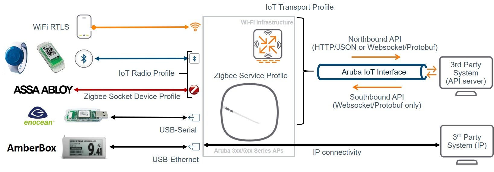

# Aruba IoT concepts and configuration (work in progress)

This chapter describes the principals of the Aruba IoT integrations and configuration.

[Aruba, a Hewlett Packard Enterprise (HPE) company](https://www.arubanetworks.com/) supports IoT applications based on Wi-Fi (e.g. Wi-Fi tracking), BLE (e.g. asset tracking or sensor monitoring), ZigBee and 3rd party protocols via USB-extension by providing the connection layer using Aruba access points. IoT devices can send/receive data via the Aruba APs built-in radios or supported 3rd party radios connected via USB to 3rd party backend system.



The Aruba AP radios can be used as transmitter/receiver (e.g. BLE connect, ZigBee) or just a receiver/sensor (e.g. BLE asset tracking, Wi-Fi tracking), depending on the respective IoT solution. With that the AP provides a one-way or two-way communication channel between IoT devices (e.g, sensors, actors) and IoT systems.  
The access point works as protocol translational gateway between the different downstream protocols/radios and the upstream Aruba IoT interface protocol or plain IP protocol depending on the respective IoT solution being used.  

## IoT connectivity (downstream)

In the downstream direction the Aruba access points support different IoT radio technologies either though integrated radios or 3rd party solutions connected to the APs USB port.

### **Wi-Fi**

The Aruba access point Wi-Fi radios can be used to forward associated/unassociated client information and RTLS data for Wi-Fi based tracking use cases. Wi-Fi client and RTLS data is encapsulated in the Aruba IoT interface protocol and forwarded upstream to the IoT backend system.  

### **Aruba IoT radio**

An Aruba IoT radio is an additional internal or external radio in the Aruba AP-3xx/5xx series access points that can be leveraged for IoT connectivity.  
A single Aruba AP-3xx/5xx series access points can support up to two IoT radios, one internal and one external. This would used cases where one radio could be used for BLE and another for ZigBee for example.  
The access point removes/adds the radio specific headers downstream from/to IoT devices e.g. BLE or ZigBee and forwards/receives the data payload encapsulated in the Aruba IoT interface protocol upstream to/from the IoT backend system.  

#### **_Integrated_**

Aruba AP-3xx/5xx series access points provide an integrated Aruba IoT radio for downstream IoT connectivity supporting the following radio technologies:

- AP-3xx: BLE4 (Gen1)
- AP-5xx: BLE5/802.15.4 (Gen2) e.g. ZigBee

#### **_External_**

In addition to the internal IoT radio Aruba also provides [IoT expansion radio](https://www.arubanetworks.com/assets/ds/DS_IoT-Expansion-Radio.pdf) supports the same radio technologies as the AP-5xx series access points:  

- Aruba IoT Expansion Radio = BLE5/802.15.4 (Gen2) e.g. ZigBee

> **_Note:_**  
> The internal and the expansion BLE5/802.15.4 (Gne2) IoT radio can only run in BLE or ZigBee mode at any point in time. Running both protocols in parallel is currently not supported (even if this options is available in the configuration).  

The configuration of the Aruba IoT radios is handled in [IoT radio profile](#iot-radio-profile) configuration.

### **USB/3rd party IoT radios**

Aruba supports the extension of Aruba access points using USB with supported 3rd party solutions. Depending on the particular solution the integration uses one of the following methods:

- USB-to-serial
- USB-to-ethernet

In all cases the USB connected host system removes/adds the radio specific headers/protocols downstream from/to IoT devices and forwards/receives the data payload to the access point using one of the USB methods.

Supported USB connected devices does not required a specific configuration, except for vendor specific implementations, but it can be controlled which USB devices are allowed to connect to an access points. This can be controlled using an [USB ACL](#usb-acl-configuration).

#### **_USB-to-serial_**

[3rd party solutions using the USB-to-serial](#supported-usb-vendor-list-for-iot) method forwards the data payload to/from the access point using [serial-data](#serial-data). The Aruba access point encapsulates the serial-data payload in the Aruba IoT interface protocol upstream to/from the IoT backend system.

> **_Note:_**  
> No specific configuration required for USB-to-serial devices. Serial data is only forwarded though the Aruba IoT interface, if enabled upstream.  

#### **_USB-to-ethernet_**

[3rd party solutions using the USB-to-ethernet](#supported-usb-vendor-list-for-iot) method provide ethernet/IP connectivity to the connected USB host system. The USB host system is connected to the access point in the same way as a wired client. No data processing is done by the access point and ethernet/IP data packets form the USB host system is forwarded like any other ethernet/IP traffic.

#### **_Vendor specific implementations_**

[Vendor specific USB integrations](#supported-usb-vendor-list-for-iot) that do not follow the previously mentioned methods use dedicated configurations.  
 
- [SES Imagotag Electronic Shelf Labels (ESL)](#vendor-specific-implementations)

## Server connectivity (upstream)

In the upstream direction IoT data payloads are either forwarded directly by [USB-to-ethernet](#usb-to-ethernet) connected devices using IP transport or using an [Aruba IoT server connection type](#aruba-iot-interface---server-connection-types) depended transport protocol and data encapsulation.

USB-to-ethernet connectivity only requires applying a [wired-ap port profile](#wired-ap-profile) to the APs USB port.  

> **_Note:_**  
Vendor specific USB implementations like _SES Imagotag Electronic Shelf Labels (ESL)_ are using IP transport with a [vendor specific configuration](#vendor-specific-implementations).  

Aruba IoT interface upstream connectivity is configured using [iot transport profiles](#iot-transport-profile).  

> **_Note:_**  
Up to 4 iot transport profiles can be concurrently enabled per Aruba Instant AP or ArubaOS AP-group.  
> This allows to run up to 4 IoT applications concurrently e.g., Aruba Meridian Beacon Management + Aruba Meridian Asset Tracking + 3rd Party BLE Asset Tracking + EnOcean.

### **Server connection types**

The Aruba IoT interface supports vendor specific and generic [IoT server connections](#aruba-iot-interface---server-connection-types).  

The following generic connection types allow IoT data forwarding for the different [IoT connectivity (downstream)](#iot-connectivity-downstream) protocols previously listed.

> **_Note:_**  
> The IoT-Utilities app only support Telemetry-Websocket connections.

#### **_Telemetry-Https_**

The _Telemetry-Https_ connection type can be use to send [BLE telemetry](#ble-telemetry) reports in the upstream/northbound direction only using HTTP POST requests. Downstream/southbound communication is not supported.  

This connection type can be used for BLE-based asset tracking or sensor monitoring use cases using easily consumable JSON data.

#### **_Telemetry-Websocket_**

The _Telemetry-Websocket_ connection type can be used for all [Aruba IoT interface - data forwarding types](#aruba-iot-interface---data-forwarding-types) in the upstream/northbound and downstream/southbound direction though a web socket (ws) or secure web socket (wss) connection.

Communication via the _Telemetry-Websocket_ connection is encoded using the [Google Protocol Buffers](https://developers.google.com/protocol-buffers) serialization protocol. Supported messages types (northbound API/southbound API) and the encoding and decoding of the data payloads is defined in the [Aruba IoT Protobuf Specification](#aruba-iot-protobuf-specification).

With this connection type the full IoT connection capabilities of the Aruba infrastructure are available.

#### **_Azure-IoTHub_**

The _Azure-IoTHub_ connection type can be use to send/receive [BLE data forwarding](#ble-data-forwarding)/[Serial-data](#serial-data) directly to [Azure IoT Hub](https://docs.microsoft.com/en-us/azure/iot-hub/about-iot-hub) by using AMPQ over websocket protocol.

Aruba implements its Controller/IAP as a protocol translation gateway (in Azure terms) to send data to IoT Hub on behalf of IoT devices.

For details please see the [Azure IoT Hub Integration Tech Note](#azure-iot-hub-integration) 

### **Server connection encryption**

It is recommended to only use encrypted connections to remote IoT servers.  

In order to establish secure web socket (wss) or HTTPS connections the remote serves self-signed certificate or root CA certificate has to be added to the Aruba controller/Instant Access Points trusted CA list.  

> **_Note:_**  
>If the IoT server certificate is un-trusted the server connection will not be established.

Please refer to [importing certificates](#importing-certificates) for how add import required certificates.

> **_Note:_**  
>The IoT-Utilities app provides a download link on the web dashboard to download the self-signed server certificate. Alternatively a certificate signed by a private or public CA can be installed into the app.

### **Authentication and authorization**

Depending on the [Aruba IoT server connection type](#aruba-iot-interface---server-connection-types) different authentication and authorization methods are supported/required to establish upstream server connections.

### **Server connection management**

Server connections are established form every single Aruba Instant access point, in case of a controller-less setup, and from every Aruba controller in case of a controller-based setup.  

For example, in a controller cluster setup with 4 controllers every controller will establish a connection to the remote server.

In a controller based setup IoT data in forwarded to the remote IoT server via the active controller only. In case of a failover the AP communication will also failover to the backup controller IoT interface connection. This is especially important for southbound/downstream  connection management in the respective IoT server.

> **_Note:_**  
> In an ArubaOS controller setup the number of server connections equals the number of controllers.
> In an Aruba Instant setup the number of server connections equals the number of APs.  

## Aruba IoT interface - data forwarding types

The Aruba IoT interface supports different forwarding mode for the IoT data payloads.

### **Wi-Fi telemetry**

The Wi-Fi telemetry service sends periodic reports about all the Wi-Fi devices that are discovered by an AP. The AP sees
over the air wireless frames from devices that are in the vicinity of the AP. The AP classifies these devices into (a)
associated stations: devices for which we observe bi-directional frames, i.e., going from AP to station and from station to
AP, and (b) unassociated stations: devices for which we observe frames either going to the devices or from the device to
its associated AP. At every reporting interval, in the periodic report for each station, we will send the tuple of station MAC
address, received signal strength (RSSI), and device class.
To enable the WiFi telemetry service in the IoT transport profile, the user will need to include the wifi-assoc-sta and wifiunassoc-sta classes in the device class filter. The configured server will receive one or more Google Protocol buffer
encoded messages, depending upon the number of observed stations, at every reporting interval. Note that the WiFi
telemetry is only available when the server type is set to Telemetry-Websocket.

### **Wi-Fi RTLS data forwarding**

The WiFi RTLS data telemetry service forwards the wireless data frames that originate from unassociated Wi-Fi tags to the
configured server. Wireless packets from unassociated Wi-Fi tags are distinguished from other frames based on the
wireless packet type, and the values of the toDS and fromDS flags in the frame control field. When the incoming packet is
a data frame with either toDS = 1 and fromDS = 1, or toDS = 0 and fromDS = 0, then the AP tries to match the MAC
address from the Address 1 field to the destination MAC address configured in the transport profile. If it is a match then
the AP generates a report with the device MAC address, received signal strength (RSSI), device class (set to “wifiTag”) and
the payload of the wireless frame.
To enable the WiFi RTLS data telemetry service in the IoT transport profile, the user will need to include the wifi-tags class
in the device class filter. Whenever the AP sees a frame that matches the MAC address configured in the rtlsDestMAC
field in the IoT transport profile, it will immediately send a report to the configured server as a Google Protocol buffer
encoded message. Note that the WiFi telemetry is only available when the server type is set to Telemetry-Websocket.

### **BLE Telemetry**

The BLE telemetry service sends periodic reports about all BLE devices that are discovered by an AP. The AP will continuously listen for advertisements and scan responses. The AP will parse/decode these packets for supported BLE protocols and update the telemetry data in its internal table. The contents of this table will be reported as BLE telemetry data at the configured report interval by every AP.  

>**_BLE table limits:_**
>- max: 512 devices per AP  
>- Oldest entries are deleted first (FIFO)

These telemetry reports contain a summary of all the BLE devices that are seen by a particular AP. For each individual BLE device the supported protocol information will reported. For unsupported BLE protocols at least the BLE MAC address and the RSSI value are reported.  

An example of these reports and the JSON schema can be found in the [Aruba IoT Telemetry JSON Schema documentation](#aruba-iot-telemetry-json-schema).

## **BLE data forwarding**

The BLE data service forwards all BLE advertisement frames and scan response frames from certain BLE devices. No
special configuration is needed to enable BLE data. The BLE data service is automatically enabled.
BLE data service applies to the following set of device classes: [mysphera, abilitySmartSensor, sBeacon,
exposureNotification, wiliot and???].
BLE Data forwarding works by forwarding the raw BLE data packets to the subscriber immediately when they are
received by the AP. These messages increase the traffic over the WebSocket, as you will receive a message for every BLE
advertisement and scan response eligible devices send.
It is also important to remember that BLE data forwarding happens in addition to the periodic telemetry reporting. The
two happen in parallel. If BLE data forwarding is the main method for which a subscriber would like to receive data, a
high “reporting interval” can be configured in the iot-transport-profile.

### **BLE connect**

The BLE connections service provides primitives to connect and interact with BLE devices remotely via the IoT interface.
This allows our partners to reach out and manage their devices via the Aruba WLAN infrastructure. This service is generic
to all BLE devices. The operations map closely to the BLE GATT protocol.

### **Serial-data**

Starting AOS 8.7, Aruba APs support data forwarding service for 3rd party IoT radios that are connected to the AP
via the USB port. Every 3rd party radio requires custom integration involving bundling the device driver, port
configuration and message parsing subrooutines into the AP's software image. When the 3rd party IoT radio is
plugged into the USB port, it presents itself as a serial over USB device to the AP after the appropriate driver
installation.
The serial data sent by the 3rd party radio to the AP is encoded into a Google Protocol Buffer formatted message
and forwarded to the server configured in the IoT transport profile. The server can also send a Google Protocol
Buffer formatted message to the AP, which will be forwarded to the 3rd party device (i.e., the serial data bytes
will be written to the serial port).The serial data forwarding service is only available when the server type is
Telemetry-Websocket. Note that in AOS 8.7, a new parameter setting for device class filter called serial-data was
added to enable forwarding messages from the attached 3rd party radio/device. Also, in 8.7 we only support the
EnOcean NWC 300U/500U DA radios (see northbound and southbound message examples below).

### **ZigBee Socket Data**

Aruba defines a new concept for Zigbee data communication Zigbee Socket Device (ZSD), which can simply the
usage for sending/receiving data over Zigbee. ZSD specifies two parts:
• inbound sockets: Inbound socket is used for receiving data from peer device.
• outbound sockets: Outbound socket is used for sending data to peer device.
Socket consists of 4 members: source-endpoint, destination-endpoint, profile ID and cluster ID. These four
parameters are defined into a message ‘ZbE2PC’ (e2pc) in the API. When a ZSD is bound to an ATW transport
profile by configuration, all data related to the e2pc can be transmitted over the ZSD. In fact, e2pc specifies a
data tunnel between server and clients. Different services have different e2pc. Sometimes, e2pc for sending is
also different from the one for receiving. Similarly, e2pc is like the port of TCP/UDP. Different ports can indicate
different services.
In the Zigbee world, for each connected device, it has a short network address which is allocated by
coordinator/router. This short network address can be treated as the IP address. In Aruba implementation, we
use the IEEE address of client device to send data, which is more generic. In the Zigbee stack, we will convert the
IEEE address to short address if we have it.

## Data filtering (Device Class Filter)

- Maximum of 16 devices classes can be selected.
- Explain all = all BLE vendors

# Configuration

```

```

## IoT radio profile

IoT radio profiles are used to configure the Aruba integrated or external (USB-dongle) IoT radio - please don't use the term "ZigBee USB dongle", it is misleading because the Aruba IoT radio is either BLE 4.x-only (Gen1 = AP 3xx series) or BLE5/802.15.4 (e.g. to support ZigBee)

## IoT transport profile

The IoT transport profile defines the Aruba IoT interface upstream settings (some settings also influence the radios side - input filters, but this is a detail that have to be covert in the details section).

Performance and limitations (e.g. max 4 IoT transport profiles per AP group)

### **Server types**

```

```

### **Proxy support**

```

```

### **Authentication/Authorization**

```

```

### **Device class filter**

```

```

### **USB ACL configuration**

```

```

### **Wired-AP profile**

```

```

# Configuration Examples

```

```

## Wi-Fi solutions

```

```

### **Wi-Fi client RSSI tracking**

```

```

### **Wi-Fi RTLS**

```

```

## BLE solutions

```

```

### **Aruba Meridian Beacon Management**

```

```

### **Aruba Meridian Asset Tracking**

```

```

### **ZF Openmatics**

```

```

### **BLE telemetry (e.g. HYPROS, PnT, ...)**

```

```

### **BLE data forwarding (e.g. Minew, Google, ...)**

```

```

### **BLE connect (e.g. ABB)**

```

```

### **Zigbee (e.g. ASSA ABLOY)**

```

```

## USB/3rd party radio solutions

```

```

### **SES Imagotag**

```

```

### **USB-to-ethernet (e.g.Solu-M, Hanshow, AmberBox, ...)**

```

```

### **USB-to-serial (e.g. EnOcean, Piera Systems, ...)**

```

```

# Appendix

## Aruba Reference Documentation

*  [ArubaOS Online Documentation](https://www.arubanetworks.com/techdocs/ArubaOS_8.7.1_Web_Help/Content/home.htm)
*  [Aruba Instant Online Documentation](https://www.arubanetworks.com/techdocs/Instant_871_WebHelp/Content/homeinstant.htm)

### Importing Certificates

* [AurbaOS Importing Certificates](https://www.arubanetworks.com/techdocs/ArubaOS_8.7.1_Web_Help/Content/arubaos-solutions/manage-utilities/impo-cert.htm)  
* [Aruba Instant Importing Certificates](https://www.arubanetworks.com/techdocs/Instant_871_WebHelp/Content/instant-ug/authentication/upload-cert.htm)

### Aruba IoT Telemetry JSON Schema

* [ArubaOS WLAN and InstantOS 8.6.0.x IoT Interface - JSON Schema Telemetry](https://asp.arubanetworks.com/downloads;pageSize=25;search=iot)
* [ArubaOS WLAN and InstantOS 8.6.0.x IoT Interface - JSON Telemetry Example](https://asp.arubanetworks.com/downloads;pageSize=25;search=iot)

### Aruba IoT Protobuf Specification

* [ArubaOS WLAN and InstantOS 8.6.0.x IoT Interface - Protobuf Specification](https://asp.arubanetworks.com/downloads;pageSize=25;search=iot)

### Azure IoT Hub Integration

* [Azure IoT Hub Integration Tech Note]() 

## Aruba IoT interface - server connection types

|Server connection type|Transport protocol|Data encapsulation|Authentication & Authorization|Supported device class filter|Description|
|-|-|-|-|-|-|
|Assa-Abloy|HTTPS|vendor specific|username/password, access ID|assa-abloy|Assa Abloy Visiononline server|
|[Azure-IoTHub](#azure-iothub)|AMQP over secure web socket|JSON|symmetric group key|all BLE types, serial-data|Connect with Azure IoT Hub|
|Meridian-Beacon-Management|secure web socket (wss)|vendor specific|access token|aruba-beacons|POST to a RESTful Meridian API|
|Meridian-Asset-Tracking|secure web socket (wss)|vendor specific|Client ID/access token|aruba-tags|Stream data to Meridian WebSocket server|
|[Telemetry-Https](#telemetry-https)|HTTP, HTTPS|JSON|username/password, client ID/secret, access token|all BLE types, wifi-assoc-sta, wifi-unassoc-sta|POST Aruba IoT telemetry reports to HTTP server endpoint|
|[Telemetry-Websocket](#telemetry-websocket)|web socket (ws), secure web socket (wss)|Protocol Buffers (protobuf)|username/password, client ID/secret, access token|all BLE types, wifi-tags, serial-data, zsd (ZigBee)|Stream data payloads to Aruba IoT interface compatible web socket server|
|ZF-Openmatics|secure web socket (wss)|vendor specific|username/password|zf-tags|ZF Openmatics cloud management|

## Supported IoT vendor/device class list

|Device class|IoT connectivity (radio)|Supported server connectivity|Minimum required SW version|Description|
|-|-|-|-|-|
|aruba-beacons|BLE|Meridian-Beacon-Management, Telemetry-Https, Telemetry-Websocket|8.4.0.0 or higher|Forward Aruba beacon BLE device data payloads|
|aruba-tags|BLE|Meridian-Asset-Tracking, Telemetry-Https,Telemetry-Websocket|8.4.0.0 or higher|Forward Aruba tag BLE device data payloads|
|aruba-sensors|BLE|Telemetry-Https, Telemetry-Websocket|8.5.0.0 or higher|Forward Aruba sensor BLE device data payloads|
|ibeacon|BLE|Telemetry-Https, Telemetry-Websocket|8.4.0.0 or higher|Forward iBeacon BLE device data payloads|
|eddystone|BLE|Telemetry-Https, Telemetry-Websocket|8.4.0.0 or higher|Forward Eddystone BLE device data payloads|
|zf-tags|BLE|ZF-Openmatics or Telemetry-Https, Telemetry-Websocket|8.3.0.0 or higher|Forward ZF-Openmatics tag BLE device data payloads|
|enocean-sensors|BLE|Telemetry-Https, Telemetry-Websocket|8.4.0.0 or higher|Forward EnOcean sensor BLE device data payloads|
|enocean-switches|BLE|Telemetry-Https, Telemetry-Websocket|8.4.0.0 or higher|Forward EnOcean switch BLE device data payloads|
|mysphera|BLE|Telemetry-Https, Telemetry-Websocket|8.6.0.0 or higher|Forward MySphera BLE device data payloads|
|ability-smart-sensor|BLE|Telemetry-Https, Telemetry-Websocket|8.6.0.0 or higher|Forward ABB sensor BLE device data payloads|
|sbeacon|BLE|Telemetry-Https, Telemetry-Websocket|8.6.0.0 or higher|Forward sBeacon(HID) BLE device data payloads|
|wiliot|BLE|Telemetry-Https, Telemetry-Websocket|8.8.0.0 or higher|Forward Wiliot BLE device data payloads|
|exposure-notification|BLE|Telemetry-Https, Telemetry-Websocket|8.7.0.0 or higher|Forward Apple/Google exposure notification framework BLE device data payloads|
|blyott|BLE|Telemetry-Https, Telemetry-Websocket|8.8.0.0 or higher|Forward Blyott BLE device data payloads|
|diract|BLE|Telemetry-Https, Telemetry-Websocket|8.8.0.0 or higher|Forward Diract BLE device data payloads|
|google|BLE|Telemetry-Https, Telemetry-Websocket|8.8.0.0 or higher|Forward Google BLE device data payloads|
|gwahygiene|BLE|Telemetry-Https, Telemetry-Websocket|8.8.0.0 or higher|Forward GWA Hygiene BLE device data payloads|
|minew|BLE|Telemetry-Https, Telemetry-Websocket|8.8.0.0 or higher|Forward Ninew BLE device data payloads|
|onity|BLE|Telemetry-Https, Telemetry-Websocket|8.8.0.0 or higher|Forward Onity BLE device data payloads|
|polestar|BLE|Telemetry-Https, Telemetry-Websocket|8.8.0.0 or higher|Forward Polestar BLE device data payloads|
|unclassified|BLE|Telemetry-Https, Telemetry-Websocket|8.4.0.0 or higher|all BLE devices we don’t know|
|all|BLE|Telemetry-Https, Telemetry-Websocket|8.4.0.0 or higher|all BLE devices form known vendors|
|assa-abloy|ZigBee|Assa-Abloy|8.6.0.0 or higher|Forwarding ASSA-ABLOY to Assa Abloy Visiononline server|
|zsd|ZigBee|Telemetry-Websocket|8.7.0.0 or higher|Forwarding ZigBee data payloads to an ZigBee application server|
|serial-data|USB/3rd party|Telemetry-Websocket|8.7.0.0 or higher|Forwarding serial data payloads of 3rd party USB extensions to an IoT system|
|wifi-assoc-sta|Wi-Fi|Telemetry-Websocket|8.6.0.0 or higher|Forwarding Wi-Fi client RSSI information to 3rd party|
|wifi-unassoc-sta|Wi-Fi|Telemetry-Websocket|8.6.0.0 or higher|Forwarding Wi-Fi client RSSI information to 3rd party|
|wifi-tags|Wi-Fi|Telemetry-Websocket|8.6.0.0 or higher|Forwarding Wi-Fi tag data to 3rd party system|

## Supported USB vendor list for IoT

|Vendor|Minimum required AOS/Instant Version|Connection method|Description|
|-|-|-|-|
| SES Imagotag|8.4.0.0 or higher|[vendor-specific](#vendor-specific-implementations)| ESL USB dongle (on-premise mgmt) |
| SES Imagotag|8.8.0.0 or higher|[vendor-specific](#vendor-specific-implementations)| ESL USB dongle (cloud mgmt) |
| Solu-M|8.5.0.0 or higher|[usb-to-ethernet](#usb-to-ethernet)| ESL Solu-M USB Gen1 GW|
| Solu-M|8.8.0.0 or higher|[usb-to-ethernet](#usb-to-ethernet)| ESL Solu-M NEWTON USB Gen2 GW|
| Hanshow|8.6.0.0 or higher|[usb-to-ethernet](#usb-to-ethernet)| ESL USB dongle |
| AmberBox|8.6.0.0 or higher|[usb-to-ethernet](#usb-to-ethernet)| Gunshot detector |
| EnOcean|8.7.1.0 or higher|[usb-to-serial](#usb-to-serial)|EnOcean USB 800/900 MHz |
| Piera Systems|8.8.0.0 or higher|[usb-to-serial](#usb-to-serial)|Particulate Matter (PM) Detection |
