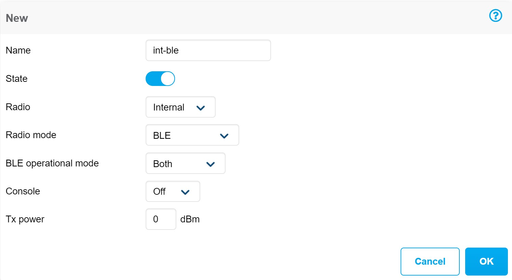
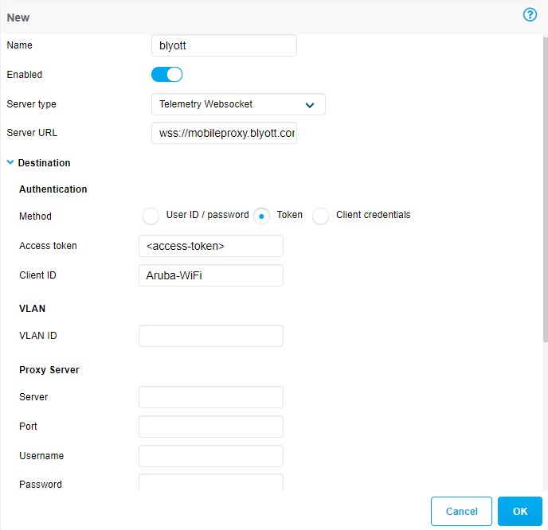
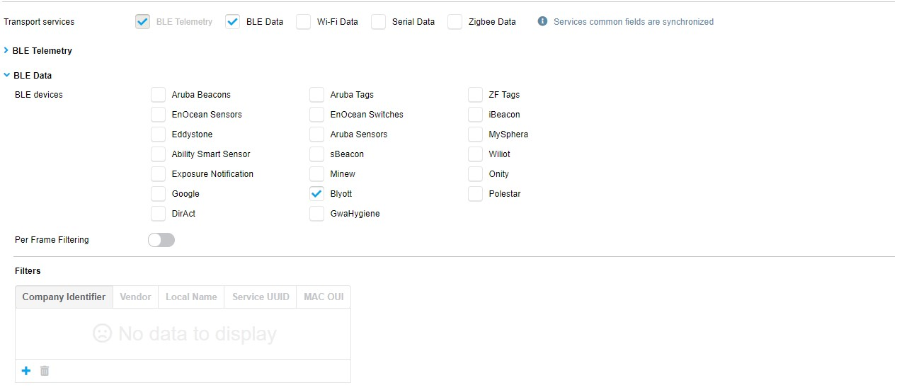
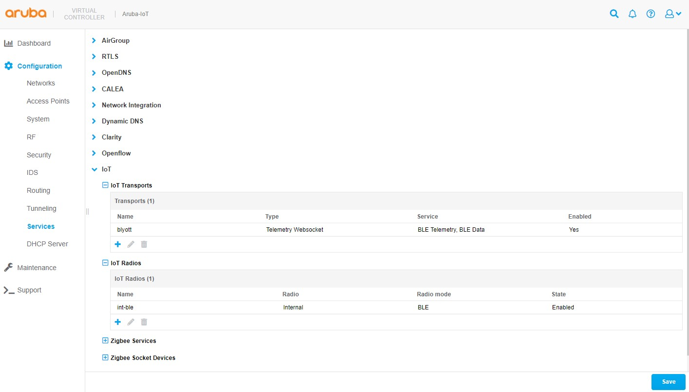

# Blyott (ArubaOS/Aruba Instant 8.8.x.x or higher)

<details open markdown="block">
  <summary>
    Table of contents
  </summary>
  {: .text-delta }
- TOC
{:toc}
</details>

This example shows the required configuration to enable the [Blyott location based and monitoring solution](https://blyott.com/) integration using ArubaOS/Aruba Instant version 8.8.x.x or higher.  

The Blyott solution integration uses the BLE data transport service with the device class ***blyott*** to report location (RSSI), temperature and battery level information in a custom BLE advertisement format in real-time to the cloud-based backend/dashboard.

-   `access-token` - has to be replaced with the static access token used to connect to the remote server
-   `client-id` - (optional) has to be replaced with the client identifier string that is used by the remote server to identify the connecting Aruba infrastructure, e.g. "Aruba-Wi-Fi".
-   `ap-group` - has to be replaced with the AP group name the configuration should be enabled on (multiple statements are required for multiple groups) (ArubaOS only)

>***Note:***  
>The [Let’s Encrypt certificate chain of trust](https://letsencrypt.org/certificates/) has to be installed on the Aruba infrastructure for the secure HTTP or secure websocket connection to the Blyott connection proxy (wss://mobileproxy.blyott.com/aruba). The Blyott server URL currently use a server certificate issued by the [Let’s Encrypt R3 intermediate CA](https://letsencrypt.org/certs/lets-encrypt-r3.pem), which is signed by the [Let's Encrypt ISRG Root X1 certificate authority](https://letsencrypt.org/certs/isrgrootx1.pem). The complete certificate chain have to be installed.
>
>Aruba deployment's trusted CA configuration would have to be updated in case the to the server certificate changes!
>
>Please see the [Aruba CLI Reference - Importing Certificates](../references/aruba_reference_documentation.md#aruba-cli-reference---importing-certificates) for details.

## ArubaOS

### ArubaOS CLI Configuration

```text
iot radio-profile "ble-int"
    radio-mode none ble
!
ap-group <ap-group>
    iot radio-profile "ble-int"
!
iot transportProfile "blyott"
    serverType Telemetry-Websocket
    serverURL "wss://mobileproxy.blyott.com/aruba"
    clientId "Aruba-WiFi"
    accessToken <access-token>
    deviceClassFilter blyott
    reportingInterval 3600
    ageFilter 30
    bleDataForwarding
    include-ap-group <ap-group>
!
iot useTransportProfile "blyott"
```

### ArubaOS GUI Configuration

t.b.d.

## Aruba Instant

### Aruba Instant CLI Configuration

```text
iot radio-profile "ble-int"
 radio-mode ble
 exit

iot use-radio-profile "ble-int"

iot transportProfile "blyott"
 endpointType telemetry-websocket
 endpointURL "wss://mobileproxy.blyott.com/aruba"
 endpointID "Aruba-WiFi"
 endpointToken <access-token>
 payloadContent blyott
 transportInterval 3600
 ageFilter 30
 bleDataForwarding

 exit

iot useTransportProfile "blyott"
```

### Aruba Instant GUI Configuration

>***Note:***  
>The example screenshots provided below show the Aruba Instant version 8.9 GUI. Even if, the Aruba Instant version 8.8 shows has a slightly different look and feel the same configuration settings still apply.

1. Login to the Aruba Instant access point web interface.  
2. In the menu on the left side go to ***Configuration > Services*** and open the sub menu ***IoT*** in the main window.  

   

3. Add a new iot radio configuration or change an existing one to enable the BLE mode of the Aruba AP's IoT radio:  

   1. Click on the ***+*** icon in the **IoT radio** sub menu to add a new iot radio profile.  

   2. Enter a profile **name**.

   3. Set the **state** switch to ***enabled***.

   4. Select the desired **radio**.

   5. Set the **radio mode** to ***BLE***.

   6. Set the **BLE operational mode** to ***both***.

   7. Set the AP's BLE **console** mode to the desired state.  

   8. Set the **tx power** to desired value, default is ***0***. This setting is only relevant when using BLE advertisements sent by the AP.  

        

   9. Click **OK** to close the iot radio profile dialog.  

4. Add a new iot transport profile to configure the connectivity to the Blyott solution backend:  

    1. Click on the **+** icon in the **IoT transports** sub menu to add a new iot transport profile.  

    2. Enter a profile **name**.

    3. Set the **State** switch to ***enabled***.

    4. Set **server type** to ***Telemetry Websocket***.

    5. Enter ```wss://mobileproxy.blyott.com/aruba``` as **server URL**.  

    6. In the **destination** section, select ***token*** as **authentication method**.  

    7. Enter the **access token** provided for your Blyott account.  

    8. *(optional)* enter a **client id**.  

    9. *(optional)* enter then desired **VLAN ID** that should be used for the server communication. Leave empty if the APs management VLAN is used.  

    10. (optional) enter **proxy server** information as required.  

          

    11. Select **BLE Data** as transport service.  

        > **Note:** The Transport service **BLE telemetry** is enabled by default and cannot be disabled.

          

    12. Select ***Blyott*** under **BLE devices** for the transport service **BLE telemetry**.  

        > **Note:** The BLE device class ***Blyott*** is supported with Aruba Instant version 8.8 or higher.  

    13. Set the **reporting interval** to ```3600 seconds```.  

          

    14. In the **Filters** section under **Advanced** enable the **Report devices that have had activity in the last** filter and set it to ```30s```.  

          

    15. Select ***Blyott*** under **BLE devices** for the transport service **BLE Data**.  

        > **Note:** The BLE device class ***Blyott*** is supported with Aruba Instant version 8.8 or higher.  

          

    16. Click **OK** to close the iot transport profile dialog.  

5. Click on **Save** to save and activate the configured settings.

    

### Configuration verification

To verify if the applied configuration is working properly check the locator status in the Blyott dashboard. The **Last Seen" field should show ***5 min or less***.


To verify the configuration on the Aruba side, connect to the Aruba Instant access point using the SSH or the local console.

1. Check if Blyott BLE devices are seen by the APs BLE radio using the command **show ap debug ble-table generic**:

    ```text
    ArubaInstantAP# show ap debug ble-table generic


    BLE Device Table [Generic]
    ---------------------------
    MAC                Address Type  RSSI  Last Update  Device Class  Generic Filter  BT-SIG Company IDs
    ---                ------------  ----  -----------  ------------  --------------  ------------------
    60:c0:bf:60:de:0b  Public        -77   I:5s         blyott        --              0x09CD
    60:c0:bf:61:0e:bf  Public        -43   I:3s         blyott        --              0x09CD


    Generic BLE devices:2
    Total BLE devices:2

    Note: Battery level for LS-BT1USB devices is indicated as USB.
    Note: Uptime is shown as Days hour:minute:second.
    Note: Last Update is time in seconds since last heard update.
    Note: Meas. Pow. is the averaged RSSI (in dBm) when the iBeacon is calibrated.
    Note: Tx_Power is shown in dBm in the APBs section for radios that support radio profile type 1. For all other APB radios, Tx_Power is a discrete level from 0-15.
    Status Flags:L:AP's local beacon; I:iBeacon; A:Beacon management capable
                :H:High power beacon; T:Asset Tag Beacon; U:Upgrade of firmware pending
                :u:Beacon management update received
    Generic Filter:S:serviceUUIDFilter; C:companyIdentifierFilter
                :M:macOuiFilter; L:localNameFilter
    ```

    If no Blyott devices show up in the APs BLE table, check the following things:

    - Are Blyott BLE devices in the range of the AP?  

    - Are the Blyott devices switched on?  

    - Has the APs IoT radio been enabled with the settings shown in the configuration section?  

    - Has the device class ***Blyott*** selected in the IoT transport configuration as shown in the configuration section?  

2. Check if the IoT transport connection to the Blyott cloud backed has been established using the commands:  

    **show ap debug ble-relay iot-profile**  
    **show ap debug ble-relay report**  

    ```text
    ArubaInstantAP# show ap debug ble-relay iot-profile

    ConfigID                                : 90

    ---------------------------Profile[blyott]---------------------------

    serverURL                               : wss://mobileproxy.blyott.com/aruba
    serverType                              : Telemetry Websocket
    deviceClassFilter                       : Blyott
    reportingInterval                       : 3600 second
    authentication-mode                     : none
    ageFilter                               : 30 second
    accessToken                             : Bly0ttBL3
    clientID                                : Aruba-WiFi
    rssiReporting                           : Average
    environmentType                         : office
    bleDataForwarding                       : TRUE
    Server Connection State
    --------------------------
    TransportContext                        : Connection Established
    Last Data Update                        : 2021-10-21 13:52:03
    Last Send Time                          : 2021-10-21 13:52:03
    TransType                               : Websocket

    ArubaInstantAP# show ap debug ble-relay report
    
    ---------------------------Profile[blyott]---------------------------

    WebSocket Connect Status                : Connection Established
    WebSocket Connection Established        : Yes
    Location Id                             : Not Configured
    Websocket Address                       : wss://mobileproxy.blyott.com/aruba
    WebSocket Host                          : mobileproxy.blyott.com
    WebSocket Path                          : aruba
    Vlan Interface                          : Not Configured
    Current WebSocket Started at            : 2021-10-21 13:40:13
    Web Proxy                               : NA
    Proxy Username&password                 : NA, NA
    Last Send Time                          : 2021-10-21 13:52:54
    Websocket Write Stats                   : 277 (39080B)
    Websocket Write WM                      : 0B (0)
    Websocket Read Stats                    : 0 (0B)

    ```

    If the websocket connection status show a different status than ***Connection Established*** uns the following command to check possible connection issues:  

    **show ap debug ble-relay ws-log \<profile>**  

3. If the connection status shows ***Connection Established*** but the communication seems not to be working correctly, use the following command to check message processing thought the websocket connection:  

    **show ap debug ble-relay tag-report**  

    >***Note:***
    >Repeat the show command multiple times to see if messages counters increase. The **Tag messages dropped** should not increase and show only a low amount of dropped packets compared to incoming and processed messages, e.g. in the 0.x % range.

    ```text
    ArubaInstantAP# show ap debug ble-relay tag-report

    ---------------------------Profile[blyott]---------------------------

    Incoming Tag messages                   : 305
    Tag messages processed                  : 301
    Tag messages dropped                    : 4
    Tag messages WS queue success           : 301
    Tag messages WS queue unavailable       : 0
    Tag messages WS not connected           : 0
    Tag messages WS sent                    : 301
    Heartbeat messages WS sent              : 181

    ```

#### Common causes of connection errors  

- Trusted certificate chain for remote IoT server certificate not installed. Only applicable for secure connections (https://, wss://)
- Wrong authentication credentials for the remote IoT server connection (access token, username/password, clientid/secret)
- Domain name resolution not configured or not working e.g. DNS server not reachable
- Connection blocked firewall or other devices in the communication path  

>***Note***:  
>Starting with Aruba Instant 8.8 IoT server connections are automatically established even if no messages need to be send to the remote server e.g. because no BLE devices are seen by the Aruba AP.  

## Aruba Central (2.5.4 or higher)

### Aruba Instant 8.x Configuration

t.b.d.

### AOS10/IoT-Operations (beta)

t.b.d.