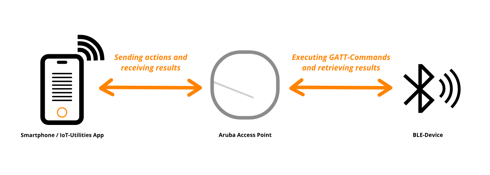
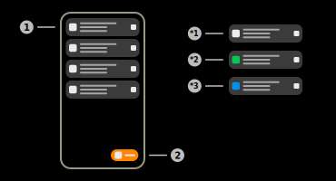
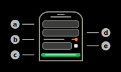
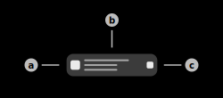
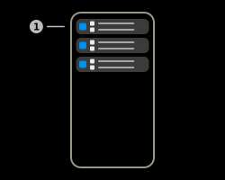

# BLE-Connect

This feature uses the Aruba IoT-Interface BLE-Connect functionality to connect to surrounding bluetooth devices via GATT. All GATT-Actions are redirected to the sensor which executes them on the local device.

## BLE-Connect Presets

The app uses "Presets" in order to save connection information of a specific device. This includes device MAC-Address, Access Points MAC-Address as well as the device name (optional). These presets can also save the "Bonding-Keys" when a device is bonded with an Access Point. They also offer the possibilty to automatically choose an Access Point depending on the received signal strength. The user can clone existing device information or manually create them.

### 1) Create-Preset button

The application offers multiple possibilites to create BLE-Connect presets. Available options:

|Option|Description|
|-|-|
|Create manually|The user has to manually specify the parameters of the BLE-Connect preset, including: Preset name, Device MAC-Address, Sensor MAC-Address.|
|Recent connections|Shows a dialog to select the connection parameters of a recent connection. A connection can be established by tapping and holding the item in the [BLE Telemetry page](./ble_telemetry.md).|
|Import from BLE-Telemetry|Shows a dialog to import device information from the collected [BLE-Telemetry](./ble_telemetry.md) data of the IoT-Server feature. Selecting a device from the list will import the name, as well as the MAC-Address of the device. The sensor will be automatically selected when connecting.|
|Import from BLE-Data|Shows a dialog to import device information from the collected [BLE-Data](./ble_data.md) of the IoT-Server feature. Selecting a device frmo the list will import the name, as well as the MAC-Address of the device. The sensor will be automatically selected when connecting.|

The dialog displayed above is used to edit and create BLE-Connect presets.

#### a) Preset name field

This text field contains the name of the BLE-Connect preset. This field contains the name of the device when importing devices (default).

#### b) Auto-Select sensors switch

When this switch is enabled, the application will automatically select the sensor with the best signal strength (RSSI-Value) when connecting to the device. This algorithm uses all data sources of the server. If this switch is enabled, the sensor MAC-Address can be left blank.

#### c) Save / Create button

Tap this button to create or save the preset respectively. This button is only tappable if the input data is valid.

#### d) Device MAC-Address field

This text field contains the MAC-Address of the BLE-Device that should be connected to. This field only accepts valid MAC-Addresses.

#### e) Sensor MAC-Address field

This text field contains the MAC-Address of the sensor that should be used during the connection. This field only accepts valid MAC-Addresses or can be disabled using the [switch](#b-auto-select-sensors-switch) above.

### 2) BLE-Connect preset item

This item represents a BLE-Connect preset as described above. Tap the item to attempt establishing a connection or swipe it off the screen to permanently delete it.

#### a) Status indicator

This icon shows the current status of the BLE-Connect presets.

***1) Default state**

The BLE-Connect preset is currently in idle state. This means that no connection with this configuration currently exists. Furthermore, a connection can be attempted to establish by tapping the preset. This state is indicated by a gray icon.

***2) Connected state**

The BLE-Connect preset is currently in idle state. This means that a session using this configuration is currently open. Tab the preset item to show the session. This state is indicated by a green icon.

***3) Bonded state**

The BLE-Connect preset is currenlty in the bonded state. This means that the bonding information, required to establish a secure connection to the device, is stored in the local encrypted database of the application. A connection can be attempted to establish by tapping the preset. This state is indicated by a blue icon.

#### b) Main information section

This section contains the main information of the preset item. The upper text of this section contains the custom name of the preset. This name was specified by either the user or the app during creation. The center text of this section displays the MAC-Address or, if available, the name of the BLE-Device. The lower text of the section contains the MAC-Address or, if available, the name of the Aruba sensor. Tap the preset to attempt establishing a connection. This feature requires the IoT-Server feature to be running.

#### c) Edit button

Tap this button to edit the parameters of the BLE-Connect preset. Tapping this button will show the [same dialog]() that is also displayed when creating BLE-Connect presets. Tap save to override the current BLE-Connect preset.

## BLE-Connect Bonds

### 1) BLE-Connect bond item

This item represents the bonding information of a specific device-sensor combination, required to establish an encrypted BLE connection. The item displays the MAC-Address of the device (upper text) as well as the MAC-Address of the sensor (lower text) used to authenticate recently. Swipe the item of the screen to delete the stored information. The bond information is stored in an encrypted database inside the application. The raw data that is saved during this process is not accessible at any time.

## BLE-Connect Sessions

The app uses "BLE-Connect sessions" when connecting to any BLE-Device using the IoT-Interface. The application is able to keep multiple session running in the background concurrently. However, the Aruba sensors only allow one session/connection per sensor/access point.