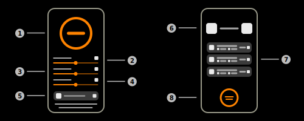
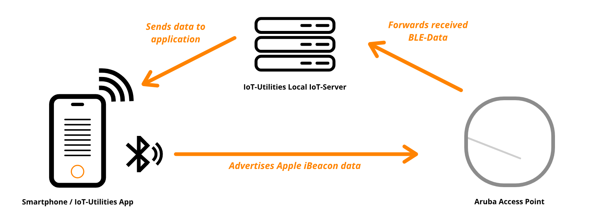

# BLE Testing

This document explains the concept of the feature BLE-Testing which uses the [Aruba IoT Interface](../aruba/aruba_iot_configuration_guide.md) to validate the user's configuration.

## Main concept

The BLE-Testing feature sends a BLE advertising packet via the bluetooth radio of the mobile device. The Aruba Access Point should receive this data and forwards it to the IoT-Server. The server validates and evaluates the incoming data. If the message contains all properties of the [Testing beacon](#testing-beacon) the Access Point / sensor will be treated as "in-range". The user can also specify multiple [parameters](#testing-parameters) to control the test and customize the testing conditions.

> **_Note:_** The server only accepts BLE-Data messages during tests to optimize performance and latency during the test.

## Testing parameters

### Testing duration

This value specifies the duration of the test. The timer starts once the ["Running"-phase](#running-stage) started. Additionally, the test will stop automatically once this time expired. The user can select a duration between 10s and 90s. This value can also be set to infinity. Consequently, the test will run in the background indefinitely.

### Sensor visibility threshold

This value specifies when an Access Point / sensor will be treated as out of range. Thus, the sensor will disappear from the list. The user can select a value between 0s (no timeout) and 60s.

### RSSI threshold

This value specifies the weakest required signal strength of the forwarded signals. Therefore, all messages that don't match the requirement will be ignored. The UI will indicate these messages by a red color. Valid messages will be indicated by the accent color of the app (orange in light-mode and blue in dark-mode). The user can specify a value between -100 and 0 dBm.

## Testing beacon

The testing beacon uses Apple's iBeacon protocol and will be used during the entire test. It will be generated during the setup process but the user can also create a new or pick an existing advertiser from the internal database.

|Value|Description|Example|
|-|-|-|
|UUID|Type 4 Univerisal Unique Identifier (pseudo-randomly-generated) refering to [RFC 4122](https://www.ietf.org/rfc/rfc4122.txt)|636645d0-2020-2020-2021-dfbaa5d78db8|
|Major|Integer value between 0 and 65536|119|
|Minor|Integer value between 0 and 65536|1278|

> **_Note:_** All values will be generated during setup and can be modifed at any time.

## Testing stages

### Idle-Stage

The idle-stage is the start stage of the test. It will also enter this stage again when the test finishes. The parameters are only changeable in this stage of the test.

### Pending-Stage

The test will enter the pending-stage if there aren't any clients available at the time of the start. Moreover, it will remain in this stage as long as no client transmitts any data. The [duration timer](#testing-duration) won't run in this stage as this stage can run indefinetely (until is is stopped or any client connects).

### Running-Stage

This is the main stage of the test. The device will start advertising the testing beacon with the specified parameters. Additionally, the app tries to free as many resources as possible, to reduce the latency. The test will start searching for the testing beacon in every arriving message. Finally, this stage will be completed when the [timer](#testing-duration) expires (if set) or the user cancels the test.

### Complete-Stage

The test will enter this stage when the [running stage](#running-stage) finished. The test service is now offline but the results are still viewable.

### Failed-Stage

The test will enter this stage when any exception occured. The test service is now offline but the results as well as the received data are visible.
