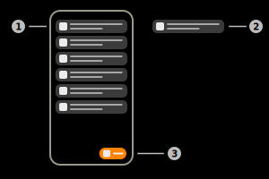

# Client Configuration

The app client configuration feature provides templates for the configuration of an Aruba infrastructure for use with this app or other 3rd party IoT solutions. The term _client_ revers to the ArubaOS Controller or Aruba Instant access point.

For details about how to setup an Aruba infrastructure to be used with this app an other IoT use cases please refer to [Aruba IoT Configuration Guide](../aruba/aruba_iot_configuration_guide.md).

> **_Note:_** This app supports the BLE and Wi-Fi Aruba IoT integrations using BLE and Wi-Fi.

## In-App Page

### 1) Configuration templates

This list represents all locally stored configuration templates. These templates are provided as a configuration help for ArubaOS and Aruba Instant deployments as is without any warranty or support at best effort. ArubaOS/Aruba Instant software version dependencies or deployment specific requirements of the used Aruba infrastructure might require custom changes to the provided template configuration.

The templates are hosted on Github here: [Config Templates](https://github.com/FluegelsApps/iot-utilities/tree/main/ConfigTemplates)

#### Placeholder/custom settings

The templates include placeholders for setup specific settings. Some of the placeholders are automatically replaced when opened in the app or the app web dashboard with the respective IoT-Utilities app settings e.g. the IP-address for ease of use. Some of the placeholders have to be manually replaced with the required values e.g. ap-group.

|Placeholder|Replacement mode|Description|
|-|-|-|
|ip-address|auto|IP address of the smartphone the apps IoT-server listens on for connections|
|port|auto|Destination port the apps IoT-server listens on for connections|
|username|auto|The username setup in the app for authentication with username/password|
|password|manual|The password setup in the app for authentication with username/password|
|clientid|manual|The client id that should be used by the Aruba infrastructure when when connecting to the apps IoT-server|
|access-token|auto|The static token setup in the app for token authentication|
|interval|auto|The report interval used by the Aruba infrastructure for telemetry reports|
|ap-group|manual|The AP group the IoT transport profile configuration should be applied to. **Only applicable to ArubaOS.**|  
| | |  

> **_Note:_** The _password_ has to be replaced with the password that as been configured in the app settings. The app has no access to the configured password ans only uses a hashed representation for authentication.

### 2) Update configuration templates

When this button is pressed, the application will start fetching the latest configuration templates from the web. The application fetches all configuration templates from [this GitHub repository](https://github.com/FluegelsApps/iot-utilities).

### 3) Configuration template item

This item represents a configuration template as described in 1 ([Configuration templates](#1-configuration-templates)). This item shows the name of the contained template. The template can be viewed by tapping the item. Swiping the item to the left or right will delete the configuration template.

## Menu features

### Keep screen on

If this checkbox is enabled, the screen of the device won't turn off automatically.

### Documentation

Tap this item to open the documentation of this page.

### Guide

Tap this item to start the guide of this page.

### Restore default templates

Tap this item to restore the default templates of the application from the local storage. This will not download the latest templates from the web as explained in 2 ([Update configuration templates](#2-update-configuration-templates)).