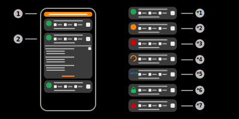
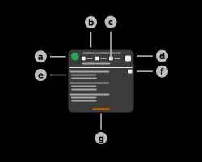

# Clients

The clients page of the app is used to manage all clients connections.

## 1) Filter interface

When this button is pressed, the filter configuration layout will appear. This layout will allow the user to configure different client filters. The filter interface can hold multiple filters of the same and different types.  
Different filter types are compared using AND, e.g. if the filters "Username" and "Client IP" are applied, the clients have to fulfill both criteria.  
Identical filter types are compared using OR, e.g. if two filters of the type "Username" are applied, the clients have to fulfill only one of the provided filters.  

|Filter|Usage|Example|
|-|-|-|
|Status|Connection status of the client connection|Available connection statuses: Offline, Connecting, Disconnecting, Disconnected, Handshaking, Receiving, Authenticating, Downloading, Authentication failed, Reauthenticating, Authenticated, Exception occurred, Receiving queued, Unknown, Deleting, Session limit exceeded, blocked|
|Client IP|Local IP-Address of the remote client|192.168.100.12|
|Client ID|Aruba Client-Identifier (configured), can be any string|MM-HomeLab|
|Username|Client username used during authentication|iotuser|

## 2) Client session item

This item represents a remote client session. This item displays various information on the client session. The app is refering to client sessions, this means that any client can connect on multiple ports to the application's IoT-Server.  
Tap this item to show all sensors of this client.

### a) Connection status icon

This icon gives some general information on the connection status of the client. The detailed connection status is displayed below.

**Available indicators:**

#### *1) Positive status

This status indicates that the client either is connected or is transmitting data.

> **_Connection statuses:_**
> Connected, Receiving, ReceivingQueued 

#### *2) Connection offline

This status indicates that the client connection is offline.

> **_Connection statuses:_**
> Connection offline, Disconnected

#### *3) Negative status

This status indicates that there was some kind of exception and the connection was terminated. This can also indicate that the connection has been blocked or the session limit has been exceeded.

> **_Connection statuses:_**
> Exception occurred, Blocked, Session limit exceeded

#### *4) Pending status

This status indicates that the app is waiting for any action to complete. This state usually is applied when the connection is being established (Connecting).

> **_Connection statuses:_**
> Connecting, Disconnecting, Deleting, Authenticating

#### *5) HTTP/HTTPS connection

This status indicates that the connection to the client is not a websocket, but a default HTTP/HTTPS connection. This usually means that the client is accessing the dashboard or other HTTP/S endpoints of the application.

#### *6) Authentication successful

This status indicates that the client has successfully authenticated and that the application is waiting for the client to connect to the websocket endpoint.

> **_Connection statuses:_**
> Authenticated, ReauthenticateToken

#### *7) Authentication failed

This status indicates that the authentication process with the client has failed. Possible causes can be found in the [description](#available-connection-statuses) of the connection status.

> **_Connection statuses:_**
> AuthenticationFailed

### b) Client address

This view displays the IP-Address and the port of the remote connection. Example: 192.168.100.41 (10938).

### c) Client information summary

These fields contains some general information of the client connection.  
**_Last seen:_** The first item displays the time, when the last message of the remote client has been received.  
**_Total messages:_** The second item displays the total count of messages that have been received.  
**_Assigned sensors:_** The third item displays the total sensor count of the connected client.  

### d) Expansion switch

This switch is used to expanse and collapse the detailed information of the remote connection.

### e) Additional connection information

This seccion of the client item contains detailed information of the remote connection and can be [expanded and collapsed](#d-expansion-switch). The section contains the following information:

|Name|Explanation|Example|
|-|-|-|
|Last request method|Method that was used during the last HTTP request|GET/HTTP/1.1|
|Last request target address|Target address that was included in the last HTTP request|192.168.100.41/wss|
|Encryption protocol|Protocol that is currently used by the SSL encryption|TLSv1.2|
|Encryption cipher-suite|Cipher-suite that is currently used by the SSL encryption|TLS_ECDHE_RSA_WITH_AES_128_GCM_SHA256|
|Authentication type|Type of authentication that was used by the remote client|static_token|
|Authentication access token|JWT token that was passed by the app during authentication with the client|any|
|Authentication refresh token|JWT token that was passed by the app during authentication with the client|any|
|Authentication Client ID|Client ID of the remote client that was passed during authentication|MM-HomeLab|
|Total data received (Miscellaneous)|Total data that has been received by the remote client in bytes (only websocket data)|1,6kB|
|Current write rate (Miscellaneous)|Current bytes written to the remote client in Bit/s or Byte/s (can be configured in the [settings](../settings/settings_general.md))|11,5kB/s|
|Current read rate (Miscellaneous)|Current bytes read from the remote client in Bit/s or Byte/s (can be configured in the [settings](../settings/settings_general.md))|64,2kB/s|

### f) Copy information button

Tap this button of the client item to copy information from the remote connection.  
Available information to copy: Target address, Client ID, Authentication username, Authentication access token, Authentication refresh token

### g) Show log button

Tap this button of the client item to display the log of this remote session.

## Available connection statuses

|Status|Explanation|
|-|-|
|Offline|The connection to the client has been closed.|
|Connecting|The connection to the remote client has been initialized but is not established as of now.|
|Disconnecting|The connection to the remote client is currently closing. This status is applied when the connection has been closed by the user. |
|Disconnected|The connection to the remote client has been closed. This action has been initiated by the user.|
|Handshaking|The client and the server are currently in the handshaking process.|
|Connected|The connection has been established and the server is waiting for the client to start transmitting data via the websocket.  |
|Receiving|The connection has been established and the client is currently transmitting data via the websocket.|
|Authenticating|The client is currently authenticating via the authentication endpoint URL.|
|DownloadingFile|The remote client is downloading data from one of the server's endpoints. This includes e.g. the server certificate.|
|AuthenticationFailed|The authentication with the remote client failed. This means that either the authentication request was invalid or the authentication parameters themselves (username, password, ...) were invalid.|
|ReauthenticateToken|The client used it's refresh token during authentication to reauthenticate.|
|Authenticated|The authentication was successful and the server is now waiting for the client to connect to any websocket endpoint.|
|ExceptionOccurred|An exception occurred in the client channel and the connection was consequently closed. The stacktrace and general error information is displayed in the client log (g).  |
|ReceivingQueued|The connection to the remote client is closed. However, the app does still processing data of the websocket. This status sometimes occurrs on devices with lower performance.|
|Unknown|The status of the connection currently is not available. This state is the default state of every connection and should never be reached.|
|Deleting|The data of the remote client is currently being deleted. This status is applied when the user dismisses the collected data of the client. |
|SessionLimitExceeded|The connection exceeded the app's concurrent session limit. This value can be configured in the [IoT-Server settings](../settings/settings_iotserver.md).|
|Blocked|The client is on the client block-list / not on the allow-list and the connection was consequently closed. |