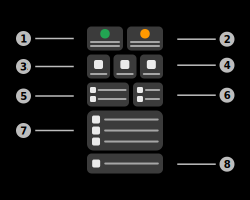

# IoT-Utilities Dashboard

The app dashboard is the main page of the application. You can control the server and it's values via this page.

## 1) Server control panel
This panel displays the current status of the server, as well as some information on it.

### a) Status
<b>- Server offline (ready)</b>
When the server is offline, the panel will show a red power icon with the title "Server ready. Tap to start". The server is ready to start.

<b>- Server offline (not ready)</b>
The panel will show a red error icon with the title ("Server not ready. More information"). This indicates that either your certificate is invalid or your device isn't connected to the internet.

<b>- Server online</b>
The panel will show a green power icon, indicating that the server is running and waiting for clients.

<b>- Server paused</b>
The panel will show a yellow power icon. The server is paused and stops all data analysis processes.

### b) Actions
**- Tapping the button:**
Tap the button to start the server.
Tap the button again to shut the server down.
Tap the button when the server isn't ready to see how to fix this issue.

Tap the button when the server is in it's "paused-state" resumes the data processing of the server.

**- Holding the button:**
Hold the button to pause the server (Server needs to be online). The app will stop processing and analysing the incoming data. Nevertheless, the clients will stay connected.

## 2) Certificate control panel
This panel displays the current status of the server certifiate.

### a) Status
<b>- Certificate is valid</b>
The panel will show a green icon and the validity of the certificate in days.

<b>- Certificate is valid (expiring in less than 30 days)</b>
The panel will show a yellow icon and the validity of the certificate in days.

<b>- Certificate is valid (expiring in less than 7 days)</b>
The panel will show an orange icon and the validity of the certificate in days.

<b>- Certificate is invalid</b>
The panel will show a red icon, indicating that the certificate already expired.

<b>- Certificate is not valid yet</b>
The panel will show a red icon, indicating that the certificate isn't valid yet. It also shows the time when the certificate will be valid.

### b) Actions
**- Tapping the button:**
Tap to button to show the certificate details page. This page contains detailed information on the certificate.

**- Holding the button:**
Hold the button to manage the current certificate. You can import or generate a new certificate.

## 3) Shortcut panels

### a) Values panel
Tap this panel to get advanced information of the server. It contains values such as:

 - Authentication username (can also be accessed in settings)
 - Authentication access token (can also be accessed in settings)
 - Server URL (Dashboard)
 - Server URL (Telemetry)
 - Server URL (Authentication)
 
 You can also copy the information displayed by this panel by using the copy button (on the right of the value).
 
### b) Web-Dashboard panel
Tap this panel to open the web-dashboard in your default browser. This panel only is clickable if the server is online.
 
### c) Client-Configuration panel
Tap this panel to open the client configuration page. More information on this page can be found in the "Client-Configuration" section of the documentation.
  
## 4) General statistics panel

### a) Clients page information and shortcut
This panel displays the current client count of the server. Tap this panel to open the Clients page. More information on this page can be found in the "Clients" section of the documentation.
 
## 5) Server traffic panel
This panel displays the current read and write rate of the server in Byte/s or Bit/s (configuration can be changed in [settings](../settings/settings_general.md)).
Tap this panel to open the [statistics page](./dashboard_traffic.md).

## 6) Northbound statistics panel

### b) Sensors page information and shortcut
This panel displays the current sensor count of the server. Tap this panel to open the Sensors page. More information on this page can be found in the "Sensors" section of the documentation.
 
### a) Telemetry data statistics panel
This panel displays the current count of Telemetry data records in the internal database. Tap this panel to open the BLE-Telemetry page. More information on this page can be found in the "BLE-Telemetry" section of the documentation.
 
### b) BLE data statistics panel
This panel displays the current count of BLE data records in the internal database. Tap the panel to open the BLE-Data page. More information on this page can be found in the "BLE-Data" section of the documentation.
 
### c) WiFi data statistics panel
This panel displays the current count of WiFi data records in the internal database. Tap the panel to open the WiFi-Data page. More information on this page can be found in the "WiFi-Data" section of the documentation.
