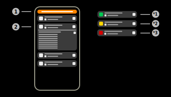

# Sensors

The sensors page of the app is used to display and manage all Aruba sensors.

## 1) Filter interface

When this button is pressed, the filter configuration layout will appear. This layout will allow the user to configure different client filters. The filter interface can hold multiple filters of the same and different types.  
Different filter types are compared using AND, e.g. if the filters "Username" and "Client IP" are applied, the clients have to fulfill both criteria.  
Identical filter types are compared using OR, e.g. if two filters of the type "Username" are applied, the clients have to fulfill only one of the provided filters. 

|Filter|Usage|Example|
|-|-|-|
|Name|Local name of the Aruba sensor|ap505h|
|Mac|Local MAC-Address of the Aruba sensor|AA:BB:CC:DD:EE:FF|
|IPv4|Local IPv4-Address of the Aruba sensor|192.168.100.XXX|
|IPv6|Local IPv6-Address of the Aruba sensor|001:0db8:3c4d:0015:0000:0000:1a2f:1a2b|
|Client IP|Parent client IP-Address of the Aruba sensor|192.168.100.XXX|
|Hardware|Hardware information of the Aruba sensor|AP-505H|
|Software|Software information of the Aruba sensor|8.8.0.1-8.8.0.1 80393|

## 2) Sensor item

